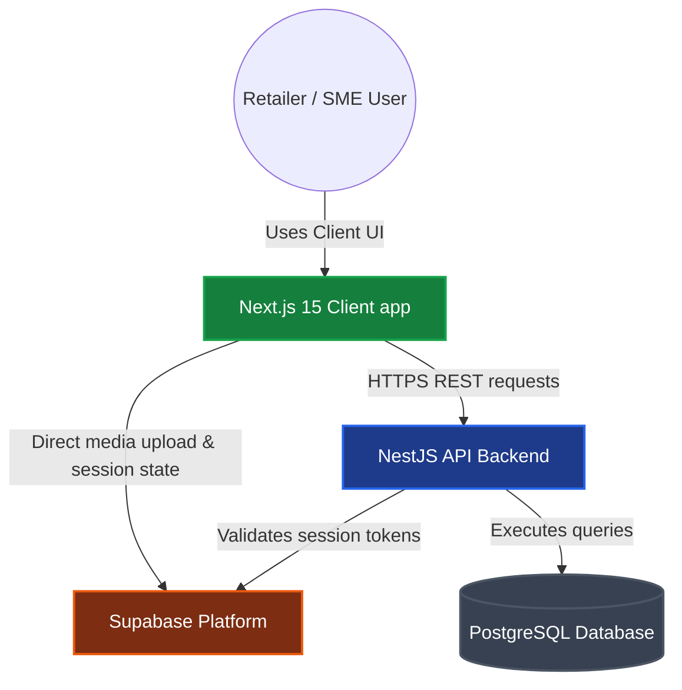
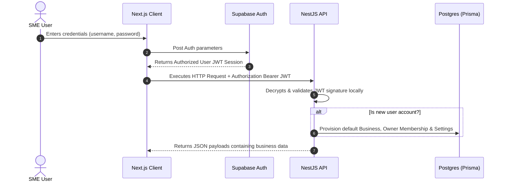

# 🍃 Invoixe — Modern GST Billing & Inventory Suite

<div align="center">
  
  
  <p align="center">
    <strong>A premium, multi-tenant GST Billing, POS, Accounting & Inventory platform for Indian SMEs.</strong>
  </p>

  <p align="center">
    <a href="https://nextjs.org/"></a>
    <a href="https://nestjs.com/"></a>
    <a href="https://prisma.io/"></a>
    <a href="https://supabase.com/"></a>
  </p>
</div>

---

## 🚀 Welcome to Invoixe

Invoixe is a comprehensive desktop-first and mobile-responsive billing platform designed to digitize Indian small and medium enterprises (SMEs). Inspired by the features of Vyapar, Invoixe simplifies retail invoicing, wholesale trade, inventory tracking, and GST reporting.

### 🌟 Core Product Features

*   **⚡ Supercharged POS Billing:** Rapid counter checkouts with instant keyboard shortcuts, dynamic item catalog search, barcode lookup, and single-click invoice generation.
*   **📑 Compliant Invoicing:** Auto-calculates CGST + SGST (intrastate) or IGST (interstate) based on buyer-seller state configurations. Supports flat discounts, rounding-off thresholds, custom terms, and custom print layouts.
*   **📦 Advanced Inventory Engine:** Define products and services with tax-inclusive/exclusive pricing structures, assign custom SKUs/codes, manage low-stock thresholds, and track batch expiries or unique serial numbers.
*   **👥 Dual-Party Ledger:** Maintain active customer and supplier profiles, set credit limits or grace periods, track opening balances, verify GSTINs, and generate ledger balance statements.
*   **🏢 Multi-Tenant Workspaces:** Create and toggle between multiple business profiles securely. Each tenant has isolated database references, dedicated storage buckets, configuration rules, and staff access controls.

---

## 📁 Monorepo Workspace Directory

Invoixe is organized as a unified monorepo leveraging npm workspaces:

Every folder under `client/`, `server/`, and `shared/` is an npm workspace. The
folder name maps to the package name you see in imports — `shared/core` is
`@invoixe/core`, and so on.

```text
├── client/
│   └── web/                 # @invoixe/web   — Next.js 15 app (Dashboard, POS, Ledgers)
│       ├── app/             #   Routes (App Router); each folder is a URL segment
│       ├── components/      #   App components (kebab-case files)
│       │   └── ui/          #   Vendored shadcn/ui primitives — regenerated, avoid hand-editing
│       ├── lib/             #   Browser-side helpers: API client, Supabase, CSV, nav
│       └── public/          #   Static assets served at the site root
├── server/
│   ├── api/                 # @invoixe/api  — NestJS REST API
│   │   ├── build.mjs        #   Production bundle (esbuild + SWC); see the file header for why
│   │   └── src/
│   │       ├── <resource>/  #   One module per resource (controller + service)
│   │       ├── common/      #   Prisma module, Supabase auth guard, Zod validation pipe
│   │       └── lib/         #   Auth types, tenancy, ledger, numbering, stock helpers
│   ├── db/                  # @invoixe/db   — Prisma client, re-exported for both sides
│   └── prisma/              #   schema.prisma + rls.sql (row-level security policies)
├── shared/
│   ├── core/                # @invoixe/core   — GST tax engine & money math (paise integers)
│   ├── types/               # @invoixe/types  — Zod schemas + the types inferred from them
│   └── config/              # @invoixe/config — Shared Tailwind preset & tsconfig base
├── scripts/                 # Repo maintenance scripts (frees dev ports before `npm run dev`)
└── package.json             # Workspace definitions & root scripts
```

**Where do I put a change?** A new screen goes in `client/web/app/<route>/page.tsx`.
A new endpoint goes in a module under `server/api/src/<resource>/`. Anything both sides must agree on —
a schema, a tax rule, a currency helper — belongs in `shared/`, never duplicated across
the two.

---

## 🛠️ System Architecture

Invoixe utilizes a split-client server framework optimized for cloud synchronization and offline resiliency:



---

## 🔐 Authentication & Session Provisioning Flow

On user sign-in or sign-up, session states synchronize between client, auth providers, and database schemas:



---

## 📝 GST Tax Calculation Pipeline

All billing calculations are performed in integers (paise) to prevent decimal floating-point rounding errors:

```mermaid
graph LR
  %% Style Definitions
  classDef moduleStyle fill:#1e293b,stroke:#475569,stroke-width:2px,color:#fff;
  classDef decisionStyle fill:#b45309,stroke:#d97706,stroke-width:2px,color:#fff;
  classDef actionStyle fill:#047857,stroke:#059669,stroke-width:2px,color:#fff;

  Input[Invoice Line Items & Addresses] --> Core[@invoixe/core Tax Engine]
  Core --> Match{Buyer-Seller State Match?}
  Match -->|Yes: Intrastate| Intra[Split Tax Rate: CGST + SGST]
  Match -->|No: Interstate| Inter[Apply Tax Rate: IGST]
  Intra --> Calculate[Calculate values in paise]
  Inter --> Calculate
  Calculate --> Round[Apply Rounding-Off Offset]
  Round --> Output[Output invoice schema structure]

  class Core moduleStyle;
  class Match decisionStyle;
  class Intra,Inter,Calculate,Round actionStyle;
```

---

## ⚙️ Environment Profile Configuration

To get started, duplicate the `.env.example` file to `.env` in the root directory:

```bash
cp .env.example .env
```

Define the configuration variables inside the `.env` profile:

```ini
# --- Dev Server Ports ---
API_PORT="5000"
NEXT_PUBLIC_API_URL="http://localhost:5000"

# --- Database pool configurations ---
DATABASE_URL="postgresql://postgres.<project>:<password>@<pooler>:6543/postgres?pgbouncer=true"
DIRECT_URL="postgresql://postgres.<project>:<password>@<host>:5432/postgres"

# --- Supabase platform keys ---
SUPABASE_URL="https://<project>.supabase.co"
SUPABASE_ANON_KEY="eyJhbGciOiJIUzI1NiIsInR5..."
SUPABASE_SERVICE_ROLE_KEY="eyJhbGciOiJIUzI1NiIsInR5..."
SUPABASE_JWT_SECRET="JWT_Secret_Token..."

# --- Client variables ---
NEXT_PUBLIC_SUPABASE_URL="https://<project>.supabase.co"
NEXT_PUBLIC_SUPABASE_ANON_KEY="eyJhbGciOiJIUzI1NiIsInR5..."
```

---

## 🛠️ Getting Started & Installation

Follow these instructions to run Invoixe locally on your machine:

### 1. Install Node Dependencies
Use the workspace orchestrator to install package dependencies:
```bash
npm install
```

### 2. Generate Prisma Schema Clients
Compile database schema configurations into generated TypeScript type libraries:
```bash
npm run db:generate
```

### 3. Launch Development Workspaces
Start the Next.js frontend (port `3000`) and NestJS API (port `5000`) together:
```bash
npm run dev
```

Stale dev servers are cleared off both ports first, then the API reports what it
can actually reach before anything claims to be ready:

```text
[api  ]   Invoixe API
[api  ]   ✓ env       H:UniCordProductInvoixe.env
[api  ]   ✓ database  Supabase Postgres — healthy (312ms)
[api  ]   ✓ auth      Supabase Auth — reachable (94ms)
[api  ]   ✓ cors      http://localhost:3000
[api  ]   ✓ api       http://localhost:5000
[api  ]   ✓ ready
[web  ]  ✓ Ready in 1.8s
[ready] ✓ Invoixe is ready in 5.6s
[ready]     web  http://localhost:3000
[ready]     api  http://localhost:5000 · database healthy (312ms)
```

A failed check prints `✗` with the reason and the summary says so rather than
"ready" — if the database is unreachable you learn it here, not from a blank
screen later. Set `API_VERBOSE=true` for Nest's full per-route logs.

Visit **[http://localhost:3000](http://localhost:3000)** in your browser, enter username `admin` and password `admin123` to log in, and begin managing your business!

---

## 🔧 Windows Troubleshooting & Layout Notes

### Next.js 15 Webpack Hydration Crash
On Windows dev systems running Next.js 15.5+, a path serialization bug in the default DevTools (Segment Explorer) overlay can cause hydration to crash with:
`TypeError: __webpack_modules__[moduleId] is not a function`

**Resolution:**
The project configuration in `next.config.mjs` has **`devIndicators: false`** enabled. This suppresses the buggy dev indicator overlay and prevents compiling crashes on Windows.

### Widescreen Spacing Optimization
To minimize excessive margins on wider displays, the application's page containers have been standardized to a maximum width of **`1600px`** (`max-w-[1600px]`), allowing operational tables, POS cart grids, and financial reports to utilize space efficiently.

---

## 💻 Developer Command Registry

All of these run from the repo root.

| Script | Runs | Description |
| :--- | :--- | :--- |
| `npm run dev` | Web + API | Starts both dev servers; frees ports `3000`/`5000` first |
| `npm run dev:client` | `@invoixe/web` | Next.js dev server on port `3000` |
| `npm run dev:server` | `@invoixe/api` | NestJS dev server on port `5000` |
| `npm run build` | All workspaces | Production build (API bundle, then Next) |
| `npm start --workspace @invoixe/api` | `@invoixe/api` | Runs the built API from `dist/main.js` |
| `npm run typecheck` | All workspaces | Type-checks every workspace |
| `npm run lint` | All workspaces | Lints source files across all workspaces |
| `npm test` | All workspaces | Runs Vitest suites for `@invoixe/core` and `@invoixe/api` |
| `npm run db:generate` | `server/prisma` | Regenerates the Prisma client — run after schema edits |
| `npm run db:push` | `server/prisma` | Pushes schema changes straight to the active database |
| `npm run db:migrate` | `server/prisma` | Runs database migrations |
| `npm run db:rls` | `server/prisma` | Executes the row-level security SQL policy script |
| `npm run db:studio` | `server/prisma` | Opens Prisma Studio on port `5555` |