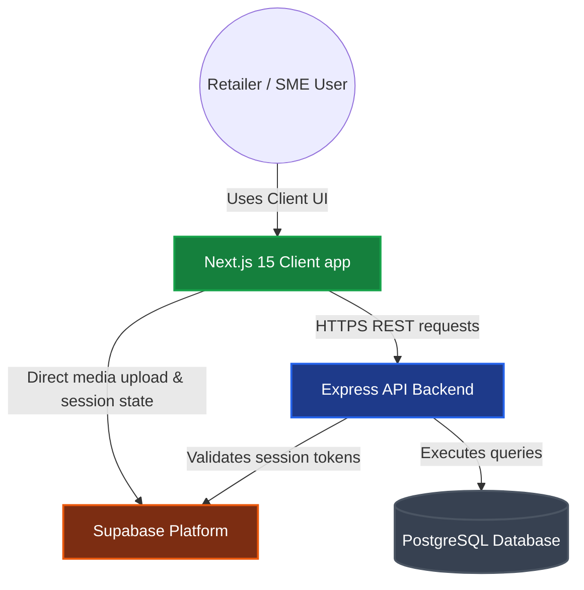

# 🍃 Leafx — Modern GST Billing & Inventory Suite

<div align="center">
  
  
  <p align="center">
    <strong>A premium, multi-tenant GST Billing, POS, Accounting & Inventory platform for Indian SMEs.</strong>
  </p>

  <p align="center">
    <a href="https://turbo.build/"></a>
    <a href="https://nextjs.org/"></a>
    <a href="https://expressjs.com/"></a>
    <a href="https://prisma.io/"></a>
    <a href="https://supabase.com/"></a>
  </p>
</div>

---

## 🚀 Welcome to Leafx

Leafx is a comprehensive desktop-first and mobile-responsive billing platform designed to digitize Indian small and medium enterprises (SMEs). Inspired by the features of Vyapar, Leafx simplifies retail invoicing, wholesale trade, inventory tracking, and GST reporting.

### 🌟 Core Product Features

*   **⚡ Supercharged POS Billing:** Rapid counter checkouts with instant keyboard shortcuts, dynamic item catalog search, barcode lookup, and single-click invoice generation.
*   **📑 Compliant Invoicing:** Auto-calculates CGST + SGST (intrastate) or IGST (interstate) based on buyer-seller state configurations. Supports flat discounts, rounding-off thresholds, custom terms, and custom print layouts.
*   **📦 Advanced Inventory Engine:** Define products and services with tax-inclusive/exclusive pricing structures, assign custom SKUs/codes, manage low-stock thresholds, and track batch expiries or unique serial numbers.
*   **👥 Dual-Party Ledger:** Maintain active customer and supplier profiles, set credit limits or grace periods, track opening balances, verify GSTINs, and generate ledger balance statements.
*   **🏢 Multi-Tenant Workspaces:** Create and toggle between multiple business profiles securely. Each tenant has isolated database references, dedicated storage buckets, configuration rules, and staff access controls.

---

## 📁 Monorepo Workspace Directory

Leafx is organized as a unified monorepo leveraging npm workspaces and Turborepo:

```text
├── client/
│   └── web/                 # Next.js 15 Web Application (Dashboard, POS, Ledgers)
├── server/
│   └── api/                 # Node.js + Express REST API Server
├── shared/
│   ├── core/                # Core calculation utilities & GST tax computation engine
│   ├── db/                  # Shared database models, Prisma client exports & scripts
│   └── types/               # Common Type definitions & Zod validation schemas
├── package.json             # Monorepo workspaces definition
└── turbo.json               # Pipeline build rules & caching configurations
```

---

## 🛠️ System Architecture

Leafx utilizes a split-client server framework optimized for cloud synchronization and offline resiliency:



---

## 🔐 Authentication & Session Provisioning Flow

On user sign-in or sign-up, session states synchronize between client, auth providers, and database schemas:


---

## 📝 GST Tax Calculation Pipeline

All billing calculations are performed in integers (paise) to prevent decimal floating-point rounding errors:

```mermaid
graph LR
  %% Style Definitions
  classDef moduleStyle fill:#1e293b,stroke:#475569,stroke-width:2px,color:#fff;
  classDef decisionStyle fill:#b45309,stroke:#d97706,stroke-width:2px,color:#fff;
  classDef actionStyle fill:#047857,stroke:#059669,stroke-width:2px,color:#fff;

  Input[Invoice Line Items & Addresses] --> Core[@leafx/core Tax Engine]
  Core --> Match{Buyer-Seller State Match?}
  Match -->|Yes: Intrastate| Intra[Split Tax Rate: CGST + SGST]
  Match -->|No: Interstate| Inter[Apply Tax Rate: IGST]
  Intra --> Calculate[Calculate values in paise]
  Inter --> Calculate
  Calculate --> Round[Apply Rounding-Off Offset]
  Round --> Output[Output invoice schema structure]

  class Core moduleStyle;
  class Match decisionStyle;
  class Intra,Inter,Calculate,Round actionStyle;
```

---

## ⚙️ Environment Profile Configuration

To get started, duplicate the `.env.example` file to `.env` in the root directory:

```bash
cp .env.example .env
```

Define the configuration variables inside the `.env` profile:

```ini
# --- Dev Server Ports ---
API_PORT="5000"
NEXT_PUBLIC_API_URL="http://localhost:5000"

# --- Database pool configurations ---
DATABASE_URL="postgresql://postgres.<project>:<password>@<pooler>:6543/postgres?pgbouncer=true"
DIRECT_URL="postgresql://postgres.<project>:<password>@<host>:5432/postgres"

# --- Supabase platform keys ---
SUPABASE_URL="https://<project>.supabase.co"
SUPABASE_ANON_KEY="eyJhbGciOiJIUzI1NiIsInR5..."
SUPABASE_SERVICE_ROLE_KEY="eyJhbGciOiJIUzI1NiIsInR5..."
SUPABASE_JWT_SECRET="JWT_Secret_Token..."

# --- Client variables ---
NEXT_PUBLIC_SUPABASE_URL="https://<project>.supabase.co"
NEXT_PUBLIC_SUPABASE_ANON_KEY="eyJhbGciOiJIUzI1NiIsInR5..."
```

---

## 🛠️ Getting Started & Installation

Follow these instructions to run Leafx locally on your machine:

### 1. Install Node Dependencies
Use the workspace orchestrator to install package dependencies:
```bash
npm install
```

### 2. Generate Prisma Schema Clients
Compile database schema configurations into generated TypeScript type libraries:
```bash
npm run db:generate
```

### 3. Launch Development Workspaces
Start Next.js frontend (port `3000`) and Express API backend (port `5000`) simultaneously:
```bash
npm run dev
```

Visit **[http://localhost:3000](http://localhost:3000)** in your browser, enter username `admin` and password `admin123` to log in, and begin managing your business!

---

## 💻 Developer Command Registry

| Workspace Script | Context Scope | Description |
| :--- | :--- | :--- |
| `npm run dev` | Monorepo Root | Compiles and starts both Web and API concurrently |
| `npm run dev:client` | `client/web` | Launches Next.js dev server on port `3000` |
| `npm run dev:server` | `server/api` | Launches Express server on port `5000` |
| `npm run build` | Monorepo Root | Bundles all static packages for production environments |
| `npm run typecheck` | Monorepo Root | Performs workspace type verification |
| `npm test` | `shared/core` | Runs jest test runner on calculation tax logic |
| `npm run db:push` | `shared/db` | Pushes local schema modifications directly to the active DB |
| `npm run db:studio` | `shared/db` | Opens the Prisma database explorer GUI on port `5555` |