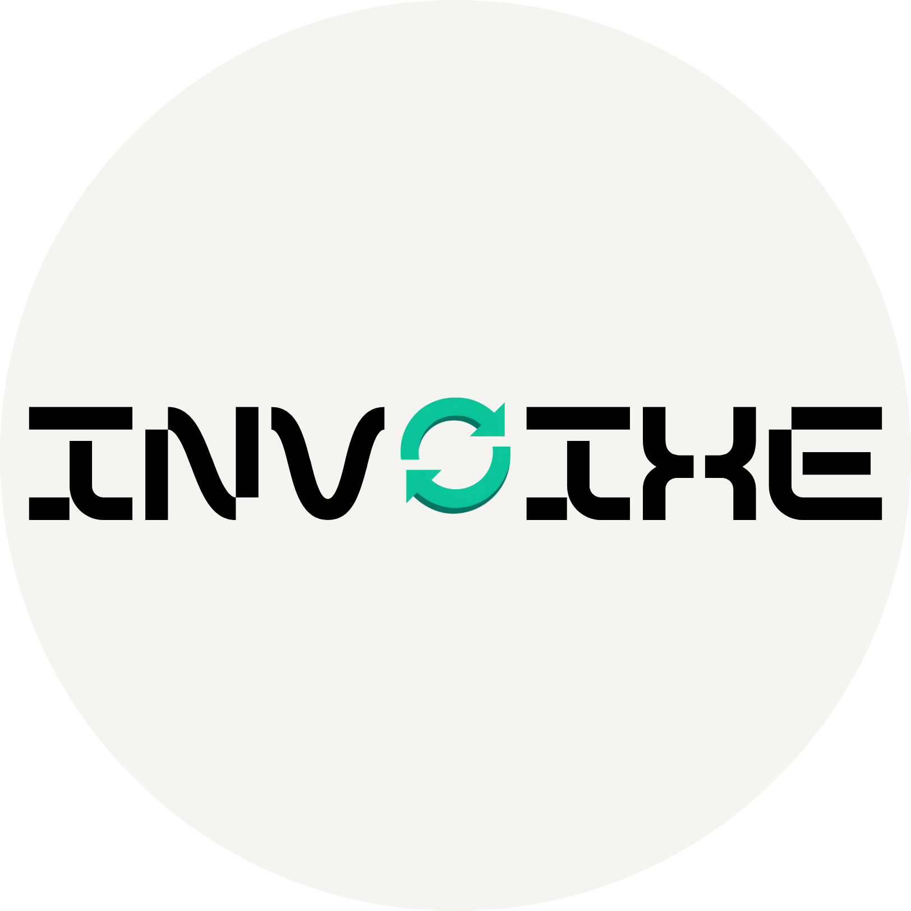

# 🍃 Invoixe — Modern GST Billing & Inventory Suite

  
  
  

    <strong>A premium, multi-tenant GST Billing, POS, Accounting & Inventory platform for Indian SMEs.</strong>
  

  

    
    
    
    
  

---

## 🚀 Welcome to Invoixe

Invoixe is a comprehensive desktop-first and mobile-responsive billing platform designed to digitize Indian small and medium enterprises (SMEs). Inspired by the features of Vyapar, Invoixe simplifies retail invoicing, wholesale trade, inventory tracking, and GST reporting.

### 🌟 Core Product Features

*   **⚡ Supercharged POS Billing:** Rapid counter checkouts with instant keyboard shortcuts, dynamic item catalog search, barcode lookup, and single-click invoice generation.
*   **📑 Compliant Invoicing:** Auto-calculates CGST + SGST (intrastate) or IGST (interstate) based on buyer-seller state configurations. Supports flat discounts, rounding-off thresholds, custom terms, and custom print layouts.
*   **📦 Advanced Inventory Engine:** Define products and services with tax-inclusive/exclusive pricing structures, assign custom SKUs/codes, manage low-stock thresholds, and track batch expiries or unique serial numbers.
*   **👥 Dual-Party Ledger:** Maintain active customer and supplier profiles, set credit limits or grace periods, track opening balances, verify GSTINs, and generate ledger balance statements.
*   **🏢 Multi-Tenant Workspaces:** Create and toggle between multiple business profiles securely. Each tenant has isolated database references, dedicated storage buckets, configuration rules, and staff access controls.