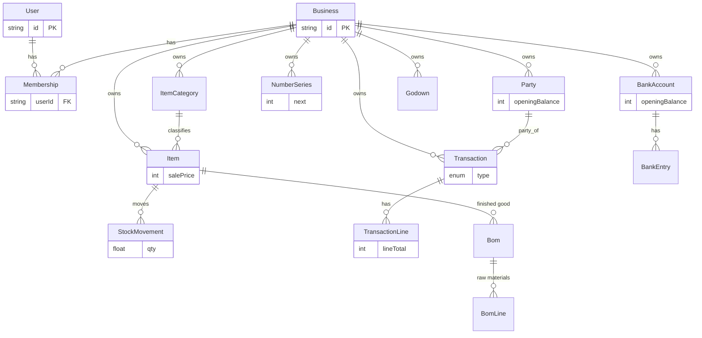
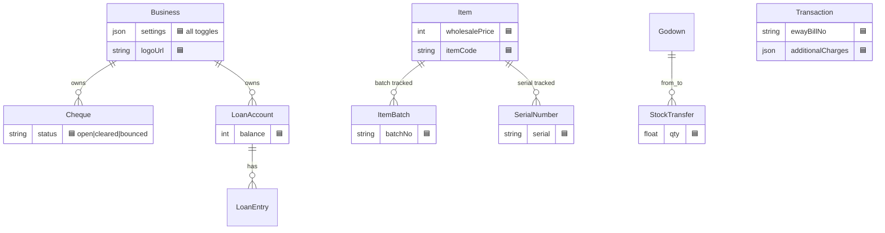

# Data Model — ERD

## 1. Purpose
The consolidated entity-relationship map of the Prisma schema (`server/prisma/schema.prisma`). Shows current tables plus Milestone-1 additions (marked 🟦). Money fields are integer **paise**; every business table has `id` (uuid), timestamps and `deletedAt` soft-delete.

## 2. Ecosystem
All business data hangs off `Business`; access is granted through `Membership`. Tenant scoping (`where businessId = active firm`) is enforced in every authed route.

## 3. Architecture — current ERD

## 4. Milestone-1 additions (🟦)

## 5. Field-level additions
| Model | New fields (🟦 Milestone 1) |
|---|---|
| **Business** | `logoUrl, signatureUrl, pincode, stateName, businessCategory, booksBeginDate, settings Json` |
| **Item** | `itemCode, wholesalePrice, imageUrl, taxOnMrp, trackBatch, trackSerial` |
| **StockMovement** | `godownId` |
| **Transaction** | `ewayBillNo, transporterName, vehicleNo, transportDistanceKm, additionalCharges, discountFlat, tcsRate, tcsAmount, tdsRate, tdsAmount, reverseCharge, termsConditions` |
| **Party** | `status, loyaltyPoints` |
| **New** | `Cheque`, `LoanAccount`, `LoanEntry`, `StockTransfer`, `ItemBatch`, `SerialNumber` |

## 6. API surface
n/a — see per-feature docs.

## 7. Key files
- `server/prisma/schema.prisma`
- `shared/types/src/index.ts` (Zod mirror + `settingsSchema`)

## 8. Status vs Vyapar
✅ Core relational model complete and tenant-safe · 🟦 additions above · migrations are additive (nullable/defaulted) → non-destructive `prisma db push`.
