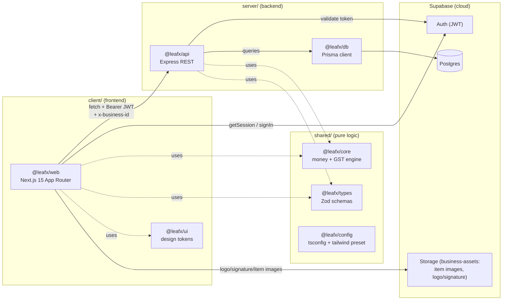
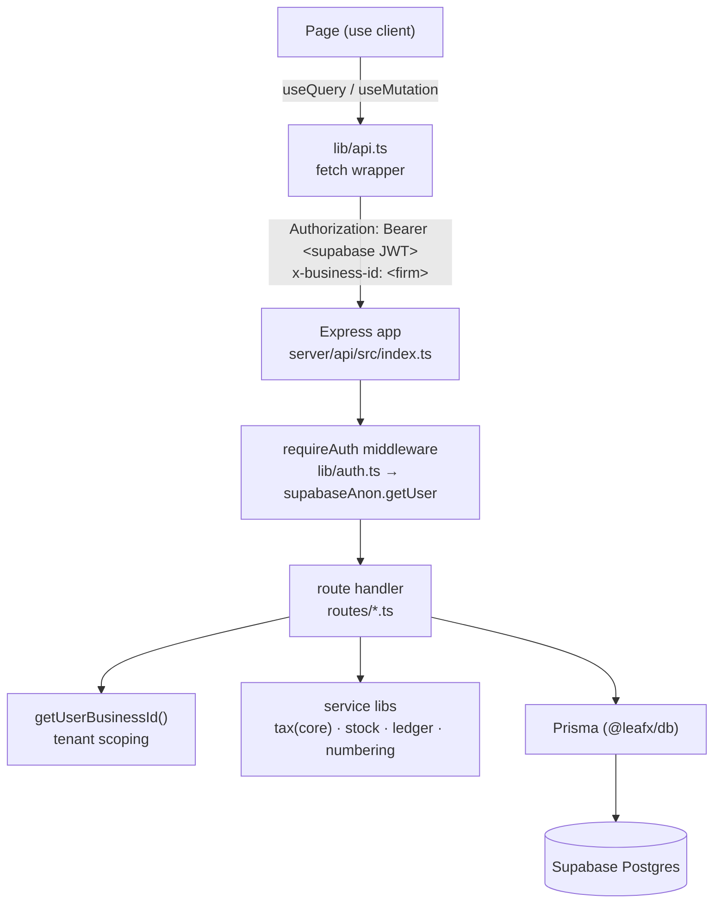
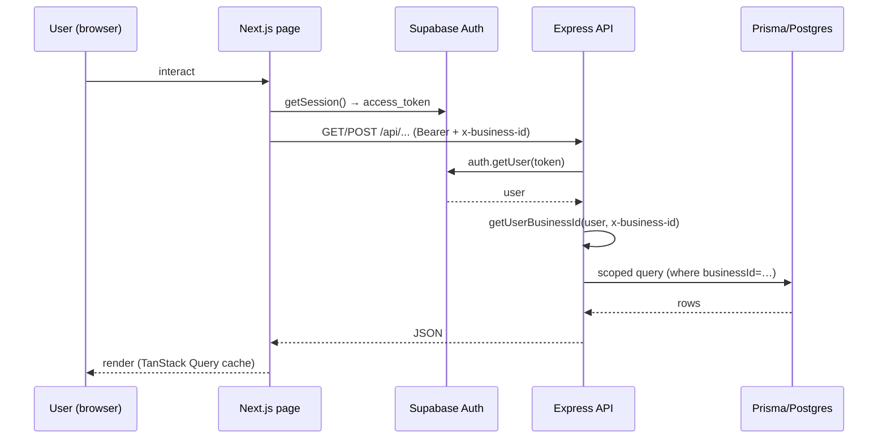

# System Overview

## 1. Purpose
Leafx is a multi-tenant GST billing, inventory and accounting platform for Indian SMEs. It is a Turborepo/npm-workspaces monorepo with a Next.js frontend, an Express REST API, a Prisma/Postgres data layer on Supabase, and shared pure-logic packages (money + GST tax engine, Zod types, design tokens).

## 2. Ecosystem

## 3. Architecture (request path)

## 4. Data model
See the consolidated ERD in [data-model-erd.md](data-model-erd.md). Core entities: `User`↔`Membership`↔`Business` (multi-tenant), and per-business `Party`, `Item`, `Transaction`(+`TransactionLine`), `StockMovement`, `BankAccount`(+`BankEntry`), `NumberSeries`, `Bom`/`Godown`.

## 5. Key flows
Cross-cutting request lifecycle:

## 6. API surface
Base URL `NEXT_PUBLIC_API_URL` (default `http://localhost:4000`), all under `/api`. Public: `/health`, `/auth/*`, `/store/*`. Authed (require Supabase JWT): `/business`, `/businesses`, `/parties`, `/items`, `/invoices`, `/payments`, `/purchases`, `/expenses`, `/documents`, `/bank`, `/cheques`, `/loans`, `/reports`, `/gst`, `/bom`, `/production`, `/godowns`, `/backup`.

## 7. Key files
- `server/api/src/index.ts` — app + route mounting
- `server/api/src/lib/auth.ts` — `requireAuth`
- `server/api/src/lib/business.ts` — `getUserBusinessId`
- `client/web/lib/api.ts` — fetch client (token + `x-business-id`)
- `client/web/app/providers.tsx` — auth gate + app shell
- `shared/core/src` — money + tax engine · `shared/types/src/index.ts` — Zod

## 8. Status vs Vyapar
✅ Multi-tenant core, all primary billing modules, settings layer, branding, cheques & loans, godown stock, batch/serial tracking, shadcn/ui design system, CSV import wizard · 🟠 Phase 12: Offline-first sync (PowerSync + SQLite — data model already sync-ready) · ⬜ Growth/marketing suite, Tally import/export, WhatsApp automation (M2+).
