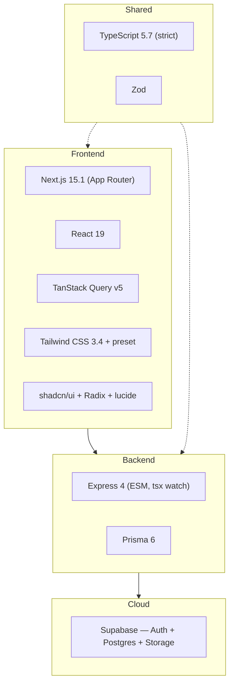

# Tech Stack

## 1. Purpose
Records the technology choices, versions, and the rationale behind them so future work stays consistent.

## 2. Ecosystem


## 3. Architecture / choices
| Layer | Choice | Why |
|---|---|---|
| Language | **TypeScript everywhere** (strict) | one language across web/api/shared; shared types |
| Monorepo | **npm workspaces + Turborepo** | pnpm needed admin/corepack on Windows |
| Frontend | **Next.js 15 App Router, React 19** | RSC + client islands, file routing |
| Data fetching | **TanStack Query v5** | cache, invalidation, mutations |
| Styling | **Tailwind 3.4** via shared preset `@leafx/config/tailwind` | shared green/red tokens |
| Components | **shadcn/ui** (Radix + CVA + lucide) on Leafx green theme — shipped in Milestone 1 | own the code, accessible primitives |
| Backend | **Express (ESM)**, `tsx watch` dev | simple REST, familiar |
| ORM | **Prisma 6** | typed models, migrations, `db push` |
| DB / Auth / Files | **Supabase** (Postgres + JWT Auth + Storage) | managed Postgres + auth in one |
| Validation | **Zod** in `@leafx/types` | one schema, client + server |
| Money | **integer paise** everywhere (never floats) | exact currency math |

## 4. Data model
Prisma schema at `server/prisma/schema.prisma`; client generated as `@leafx/db`. Both `DATABASE_URL` and `DIRECT_URL` point at the **session-mode pooler** (`...pooler.supabase.com:5432`) because the direct `db.<ref>.supabase.co` host is IPv6-only/unreachable on the dev network.

## 5. Key flows
Dev startup:
```mermaid
sequenceDiagram
  participant Dev
  participant Turbo as turbo/npm
  participant Web as web:3000
  participant Api as api:4000
  Dev->>Turbo: npm run dev
  Turbo-->|next dev (port 3000)|Web
  Turbo-->|tsx watch src/index.ts (port 5000)|Api
  Web-->|NEXT_PUBLIC_API_URL|Api
```

## 6. API surface
n/a (cross-cutting).

## 7. Key files
- `package.json` (root) — workspaces, `packageManager`, turbo scripts
- `turbo.json` — task graph
- `client/web/package.json`, `server/api/package.json`
- `shared/config/tailwind-preset.js`, `shared/config/tsconfig.base.json`
- `.env` (gitignored) / `.env.example`

## 8. Status vs Vyapar
✅ Stack finalized and running, shadcn/ui shipped (Milestone 1 complete) · 🟠 Phase 12 (offline-first sync) is next · ⬜ Dark mode toggle, Storybook (M2+).
