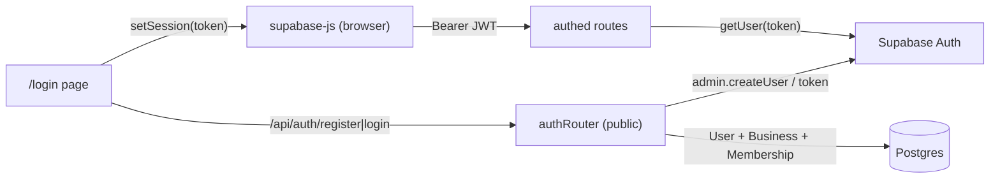
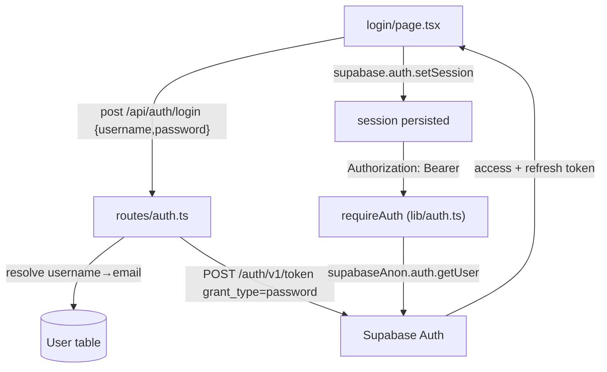
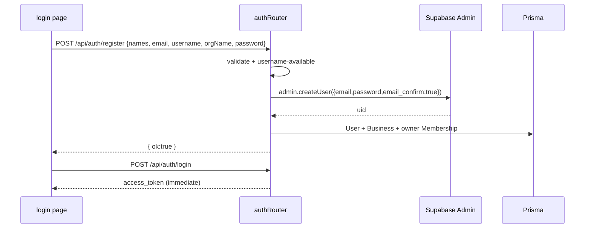

# Authentication

## 1. Purpose
Username + password login backed by Supabase Auth. Sign-up creates a **pre-confirmed** Supabase user (no email verification) plus the app-side `User`, first `Business`, and owner `Membership`. The frontend stores the Supabase session; the API validates the JWT on every authed request.

## 2. Ecosystem

## 3. Architecture

## 4. Data model
`User { id (=Supabase uid), username @unique, phone?, email?, name, firstName, lastName }`. Auth identities live in Supabase; `User` mirrors the profile and links to businesses via `Membership`.

## 5. Key flows
Register (no email verification — pre-confirmed):

## 6. API surface
- `POST /api/auth/username-available` — uniqueness check
- `POST /api/auth/otp/send|verify` — OTP endpoints (present, currently unused; email verification removed)
- `POST /api/auth/register` — create pre-confirmed user + first firm
- `POST /api/auth/login` — username→email password login → tokens

## 6b. Vestigial email-verification (cleanup pending)
The signup flow was **switched from OTP-gated to pre-confirmed** (working tree removes the
`isVerified()` gate; `admin.createUser({ email_confirm: true })` activates the account with no
email sent). Leftovers from the earlier email-verification approach remain and are **not wired**:
- `docs/templates/supabase-confirm-signup.html` + `docs/templates/email-verification-preview.html` — Supabase
  "Confirm signup" email templates, only used if project-level email confirmation is re-enabled.
- `login/page.tsx` still renders a **"Confirm your email" screen** after register (it branches on
  `d.needsConfirmation`, which `/register` no longer returns, so it always shows) and calls
  `POST /api/auth/resend` — an endpoint that **does not exist** (404).

Net effect today: a new user sees "check your email" although none is sent, yet can sign in
immediately. Resolve by either (a) removing the check-email screen + `/resend` call to match the
pre-confirmed flow, or (b) setting `email_confirm:false`, adding a `/resend` endpoint, and enabling
the Supabase templates to make verification real again.

## 7. Key files
- `client/web/app/login/page.tsx` — auth UI (GSAP landing, country picker)
- `client/web/lib/supabase.ts` — browser client
- `server/api/src/routes/auth.ts` — public auth router
- `server/api/src/lib/auth.ts` — `requireAuth` · `server/api/src/lib/supabase.ts` — anon + admin clients

## 8. Status vs Vyapar
✅ Username/password login, sign-up with firm provisioning · Email/phone **verification removed** by request (OTP endpoints dormant) · ⬜ passcode lock, accountant access, role enforcement (roles exist but unenforced — see [multi-firm-tenancy](multi-firm-tenancy.md)).
