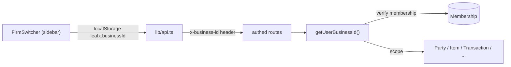
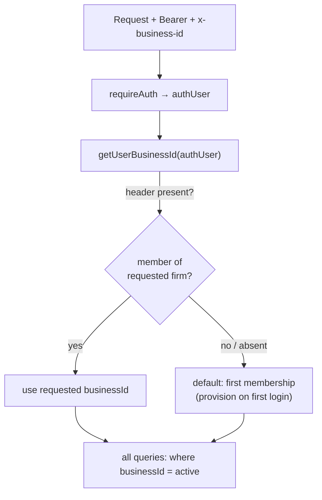
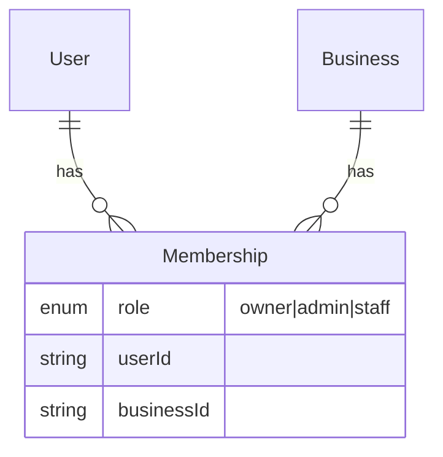
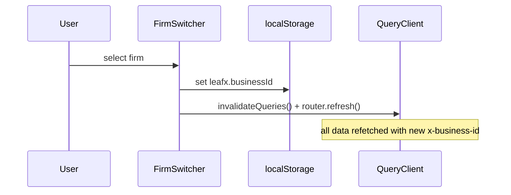

# Multi-Firm Tenancy

## 1. Purpose
A single user can own/belong to multiple businesses ("firms"). Every piece of business data is scoped to one `Business`; the **active firm** is chosen by the client and passed as an `x-business-id` header, resolved and authorized server-side.

## 2. Ecosystem

## 3. Architecture

## 4. Data model

`Membership @@unique([userId, businessId])`. `Role` enum exists but **no route enforces role-based permissions** yet (all members act as owner).

## 5. Key flows
Switch firm (planned improvement — no hard reload):

## 6. API surface
- `GET /api/businesses` — firms the user belongs to (provisions first firm)
- `POST /api/businesses` — create a firm (caller becomes owner)
- `GET/PATCH /api/business/current` — active firm profile

## 7. Key files
- `server/api/src/lib/business.ts` — `getUserBusinessId`, `getUserRole`
- `server/api/src/routes/businesses.ts`, `routes/business.ts`
- `client/web/app/firm-switcher.tsx` · `client/web/lib/api.ts` (`x-business-id`)

## 8. Status vs Vyapar
✅ Multi-firm create/switch, tenant isolation verified · 🟡 Role enum unenforced · 🟦 FirmSwitcher → shadcn dropdown, switch without full reload (Milestone 1) · ⬜ accountant/staff permission matrix (M2+).
