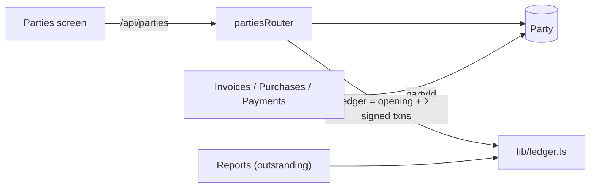
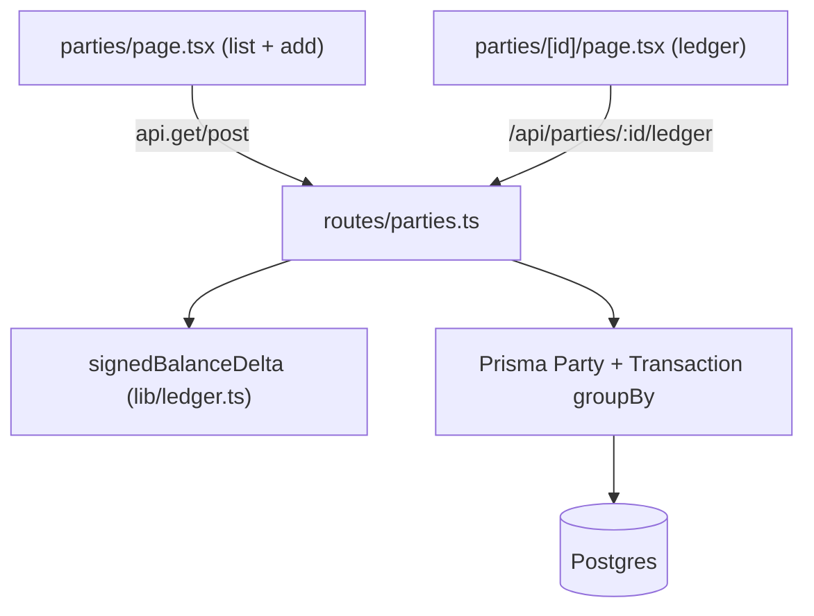
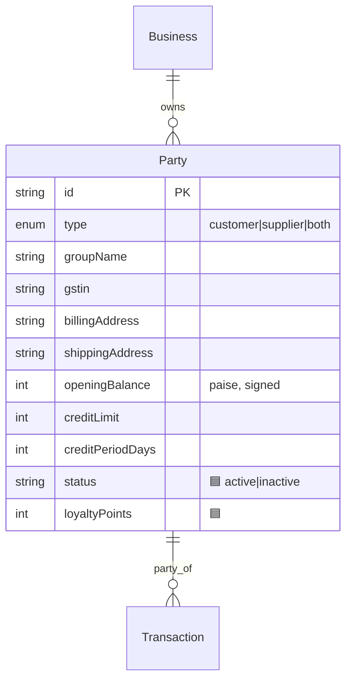
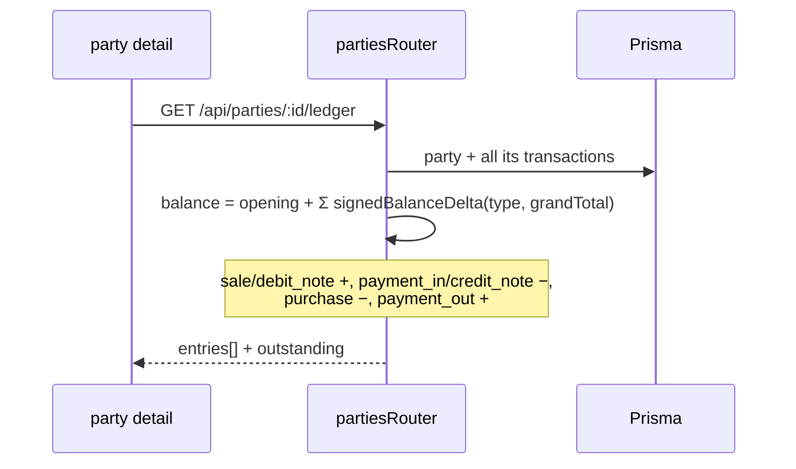

# Parties (Customers & Suppliers)

## 1. Purpose
Parties are the customers and suppliers a firm transacts with. Each party carries contact/GST details, an opening balance, optional credit terms, and a **running ledger** derived from its transactions (receivable when positive, payable when negative).

## 2. Ecosystem

## 3. Architecture

## 4. Data model

## 5. Key flows
Party ledger:

## 6. API surface
- `GET /api/parties` · `POST /api/parties` · `PATCH /api/parties/:id` · `DELETE /api/parties/:id` (soft)
- `GET /api/parties/:id/ledger`

## 7. Key files
- `client/web/app/parties/page.tsx`, `app/parties/[id]/page.tsx`
- `server/api/src/routes/parties.ts` · `server/api/src/lib/ledger.ts`
- `shared/types/src/index.ts` → `partySchema`

## 8. Status vs Vyapar
✅ CRUD, ledger, opening balance, credit limit/period, billing+shipping address, free-text group · 🟦 shadcn table + Add-Party dialog, `status`/`loyaltyPoints` fields (Milestone 1) · ⬜ true Party Groups entity, custom fields, WhatsApp connect, payment-reminder automation.
