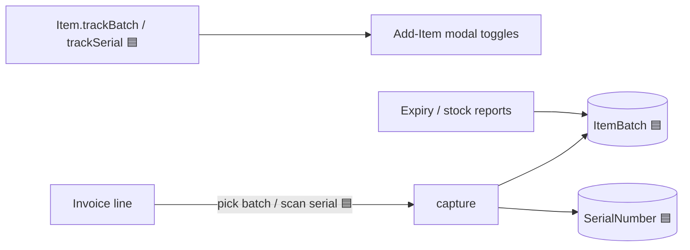
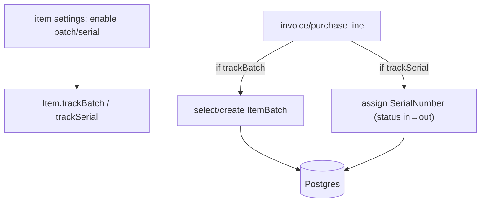
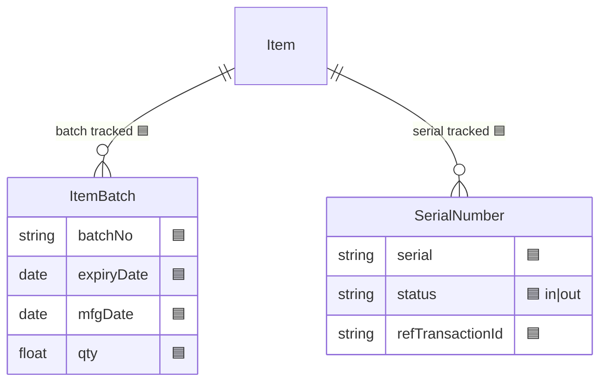

# Batch & Serial Tracking

## 1. Purpose
Optional per-item tracking modes for regulated/traceable goods: **batch tracking** (batch number + expiry + mfg date, e.g. pharma/FMCG) and **serial-number tracking** (unique unit identity, e.g. electronics/IMEI). Both are **Planned** (schema + minimal capture UI) in Milestone 1's inventory sub-phase.

## 2. Ecosystem


## 3. Architecture


## 4. Data model


## 5. Key flows
```mermaid
sequenceDiagram
  participant W as invoice line
  participant R as invoicesRouter
  participant P as Prisma
  W->>R: line for serial-tracked item + serial
  R->>P: SerialNumber.status = out, refTransactionId=inv
  W->>R: line for batch-tracked item + batchNo
  R->>P: ItemBatch.qty −= sold; validate not expired
```

## 6. API surface
Captured within existing `items`, `invoices`, `purchases` routes (no separate router planned M1). Optional read: batch/expiry listing under items.

## 7. Key files
- `server/prisma/schema.prisma` — `ItemBatch`, `SerialNumber` (🟦)
- `client/web/app/items/page.tsx` — enable toggles · invoice/purchase builders — capture
- `shared/types/src/index.ts` — line schema extension

## 8. Status vs Vyapar
⬜→🟦 Not built yet; Milestone 1 adds the schema + minimal capture. This task ("Task 18") **may slip to Milestone 2** if time-boxed · ⬜ FEFO auto-pick, expiry alerts, serial warranty lookup (M2+).
