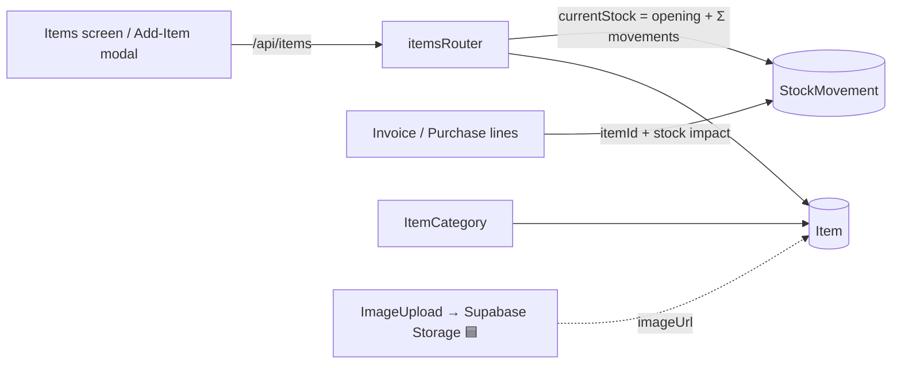
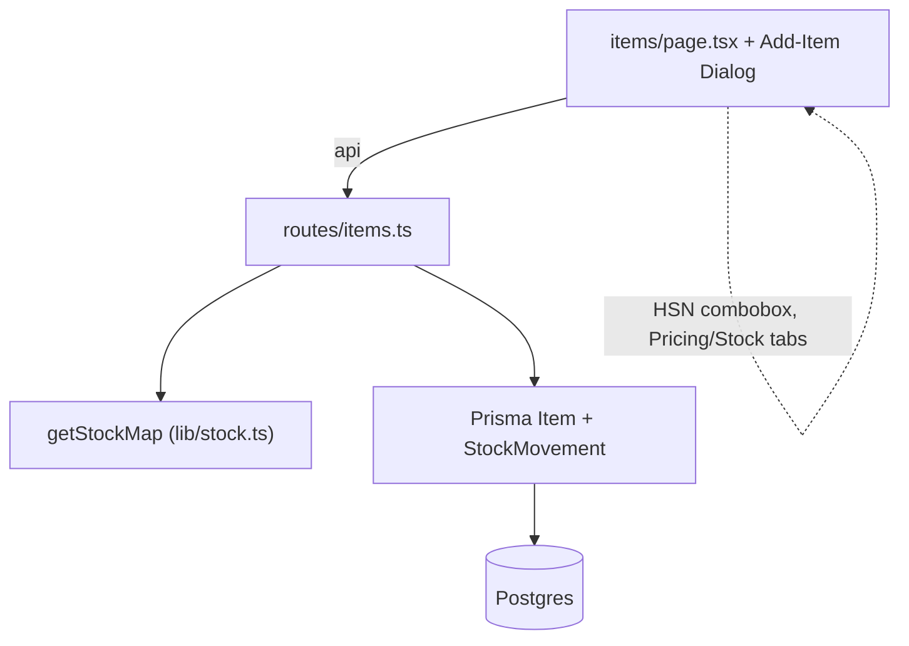
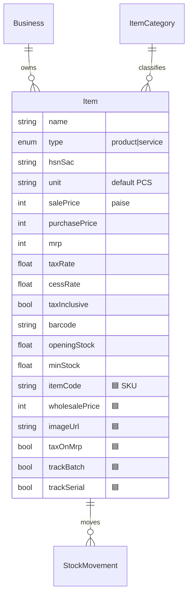
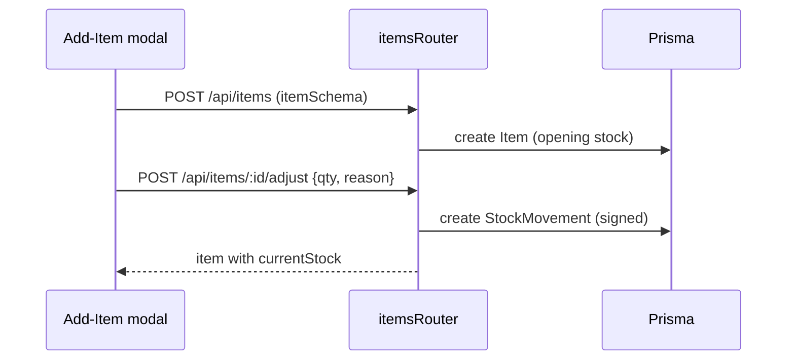

# Items (Products & Services)

## 1. Purpose
Items are the products and services a firm sells/buys. Each item holds pricing (sale/purchase/MRP, planned wholesale), tax config (rate, cess, inclusive flag), identifiers (HSN/SAC, barcode, planned item-code), a category, and inventory params (opening/min stock). Live stock is derived from signed `StockMovement` rows.

## 2. Ecosystem

## 3. Architecture

## 4. Data model

## 5. Key flows
Create item + stock adjust:

## 6. API surface
- `GET /api/items` (with `currentStock`) · `POST /api/items` · `PATCH /api/items/:id` · `DELETE /api/items/:id`
- `POST /api/items/:id/adjust` — signed stock movement

## 7. Key files
- `client/web/app/items/page.tsx`
- `server/api/src/routes/items.ts` · `server/api/src/lib/stock.ts`
- `shared/types/src/index.ts` → `itemSchema`

## 8. Status vs Vyapar
✅ Product/Service, HSN, category, unit, sale/purchase/MRP, tax rate + cess + inclusive, barcode, opening/min stock · 🟦 Vyapar-style Add-Item modal (Pricing/Stock tabs), wholesale price, item code, item image (Milestone 1) · 🟦/⬜ batch & serial → [batch-serial-tracking](batch-serial-tracking.md); godown stock → [stock-and-godowns](stock-and-godowns.md). ⬜ party-wise rate, custom fields.
