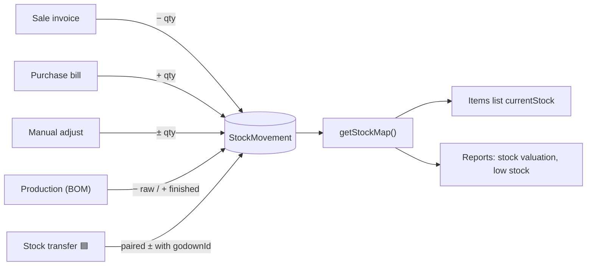
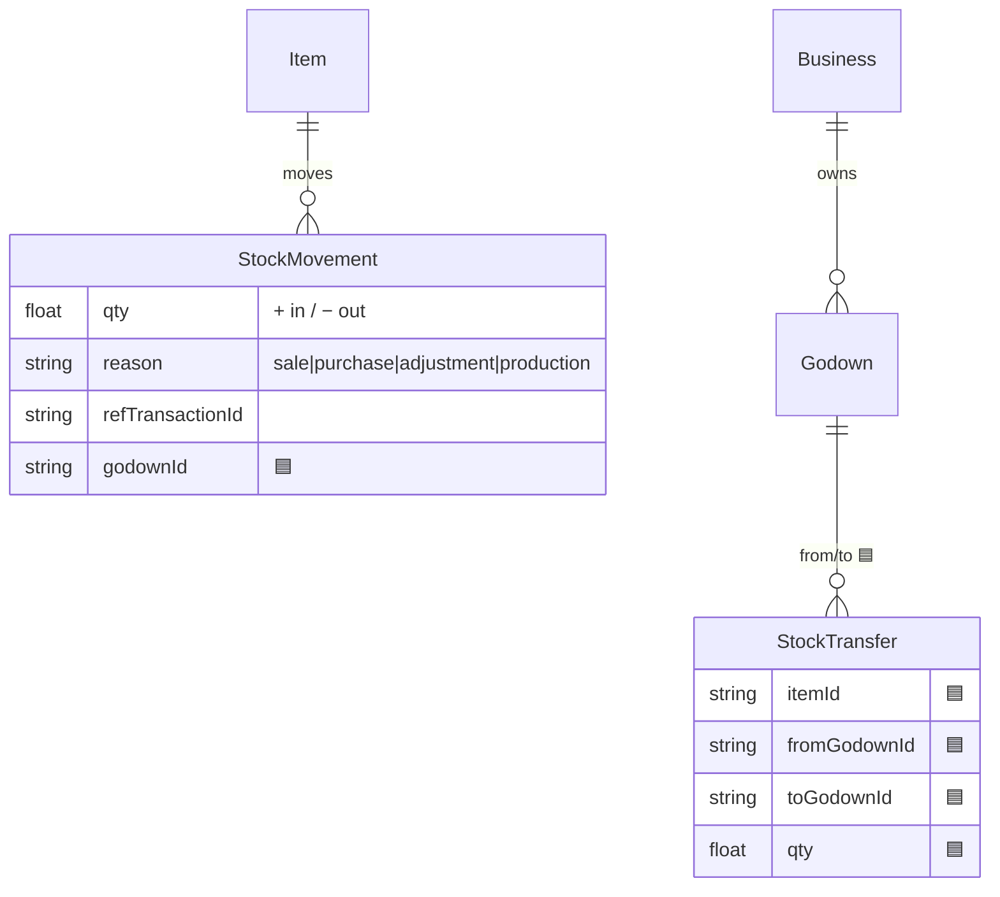
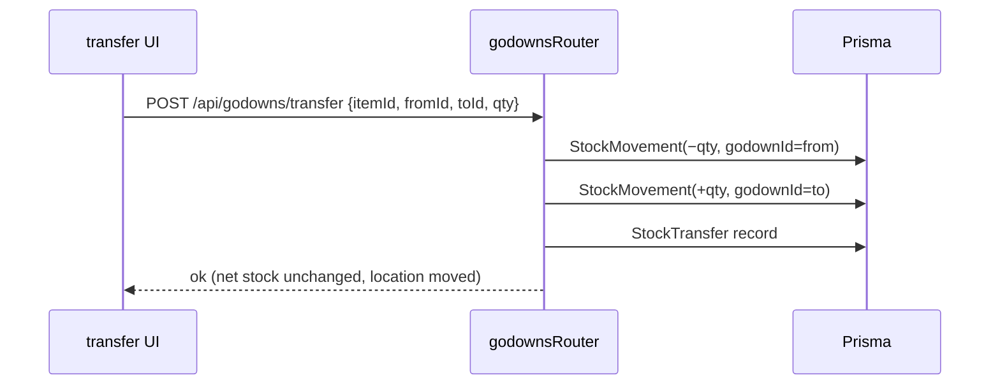

# Stock & Godowns

## 1. Purpose
Stock is tracked as an append-only ledger of signed `StockMovement` rows; current stock = `item.openingStock + Σ qty`. Godowns (warehouses/stores) are a master list today but stock is **not yet godown-aware** — Milestone 1 adds `godownId` on movements plus godown-to-godown transfers.

## 2. Ecosystem


## 3. Architecture
```mermaid
graph TD
  A["any stock-affecting route"] --> B["recordStock (lib/stock.ts)"]
  B --> C[("StockMovement { qty, reason, godownId 🟦 })"]
  D["read paths"] --> E["getStockMap(businessId)"]
  E --> C
  E --> F["current qty per item (per godown 🟦)"]
```

## 4. Data model


## 5. Key flows
Godown transfer (planned) writes paired movements:


## 6. API surface
- `GET /api/godowns` · `POST /api/godowns` (name only, today)
- `POST /api/godowns/transfer` 🟦 · stock read via `getStockMap` inside items/reports

## 7. Key files
- `server/api/src/lib/stock.ts` — `recordStock`, `getStockMap`
- `server/api/src/routes/manufacturing.ts` — godowns live here (mounted at `/api`)
- `server/prisma/schema.prisma` — `StockMovement`, `Godown`, (🟦 `StockTransfer`)

## 8. Status vs Vyapar
✅ Signed-movement stock ledger, valuation, low-stock flags · 🟡 Godown master exists but inert · 🟦 godown-aware stock + transfers (Milestone 1) · ⬜ per-godown min levels, stock audit report.
