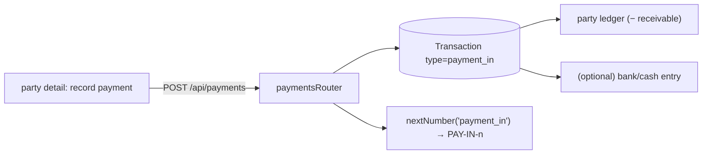
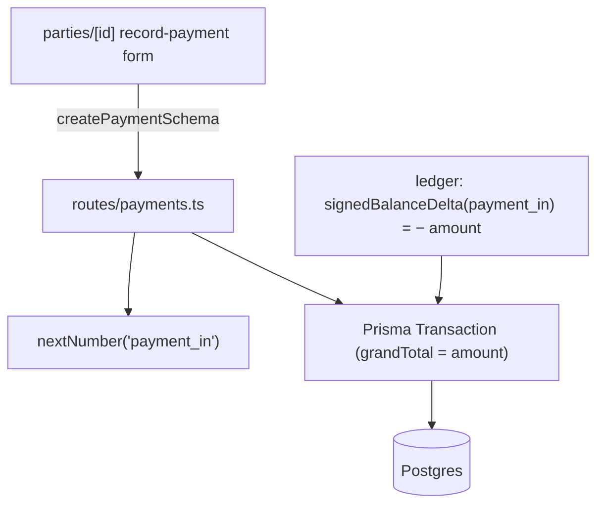
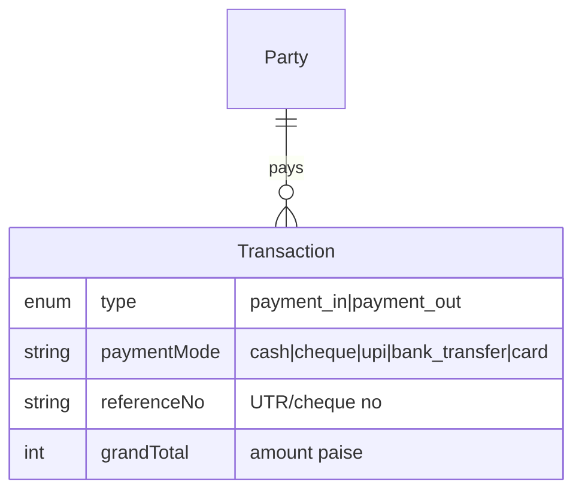
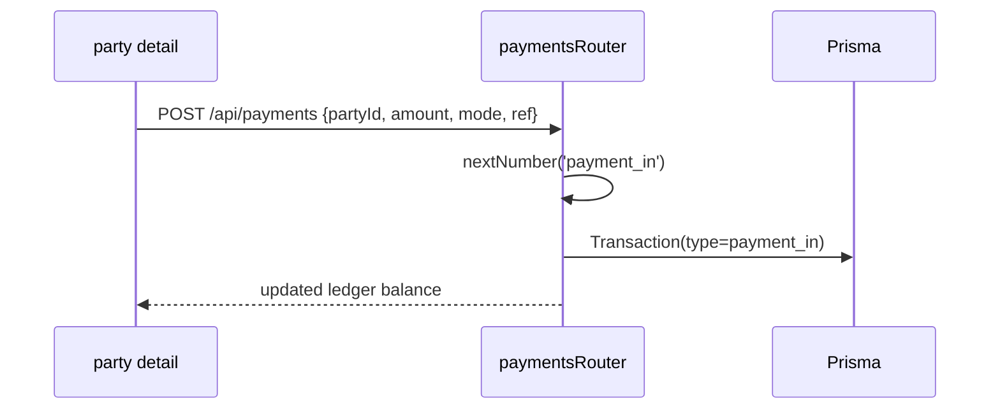

# Payments In

## 1. Purpose
Records money received from a customer against their outstanding balance. A payment-in is a `Transaction` of type `payment_in` that reduces the party's receivable in the ledger.

## 2. Ecosystem

## 3. Architecture

## 4. Data model

## 5. Key flows

## 6. API surface
- `GET /api/payments` (payment_in + payment_out) · `POST /api/payments`

## 7. Key files
- `client/web/app/parties/[id]/page.tsx` (record payment)
- `server/api/src/routes/payments.ts` · `lib/ledger.ts` · `lib/numbering.ts`
- `shared/types` → `createPaymentSchema`

## 8. Status vs Vyapar
✅ Payment-in/out, mode + reference, ledger impact, numbering · 🟦 link payments to specific invoices (bill-wise settlement) is a settings toggle (stored, wired later) · ⬜ discount-during-payment, payment links.
