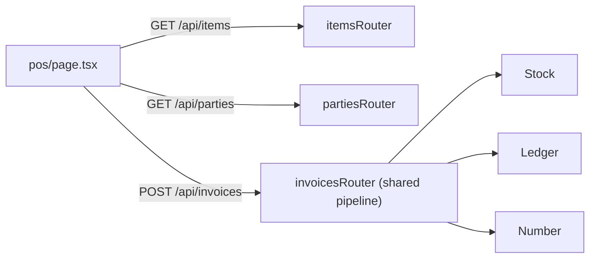
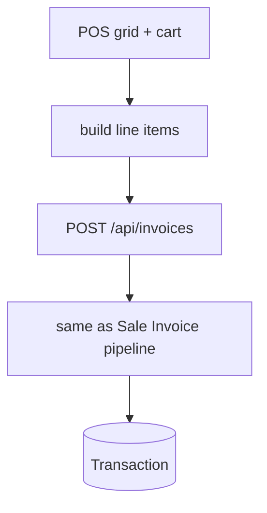
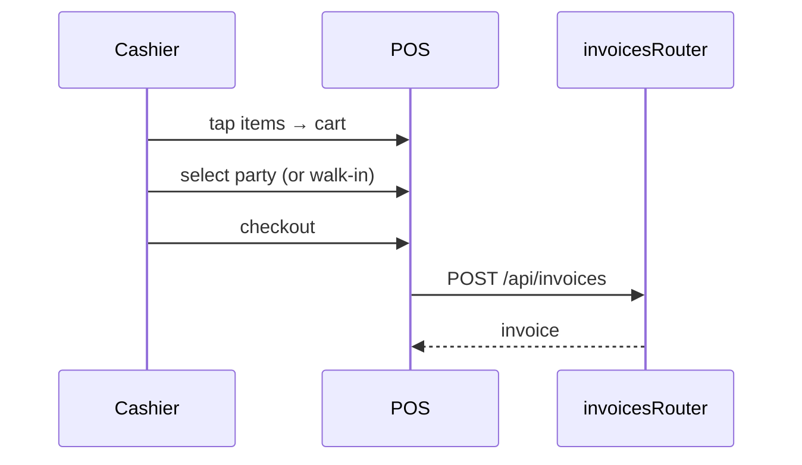

# POS (Counter Billing)

## 1. Purpose
A fast, tap-driven counter-billing screen: an item grid, a running cart, quick party selection, and one-tap checkout that posts a normal sale invoice through the same pipeline (totals, numbering, stock, ledger).

## 2. Ecosystem

## 3. Architecture

## 4. Data model
Reuses `Transaction` (`type = sale`) + `TransactionLine`. No POS-specific tables. Payment can be marked via `paymentMode`.

## 5. Key flows

## 6. API surface
No new endpoints — consumes `/api/items`, `/api/parties`, `/api/invoices`.

## 7. Key files
- `client/web/app/pos/page.tsx`
- (shared) `server/api/src/routes/invoices.ts`

## 8. Status vs Vyapar
✅ Item grid, cart, party select, invoice checkout · 🟦 shadcn polish, barcode input, quick-tender (Milestone 1 optional) · ⬜ offline mode, cash-drawer/receipt-printer integration, held bills.
