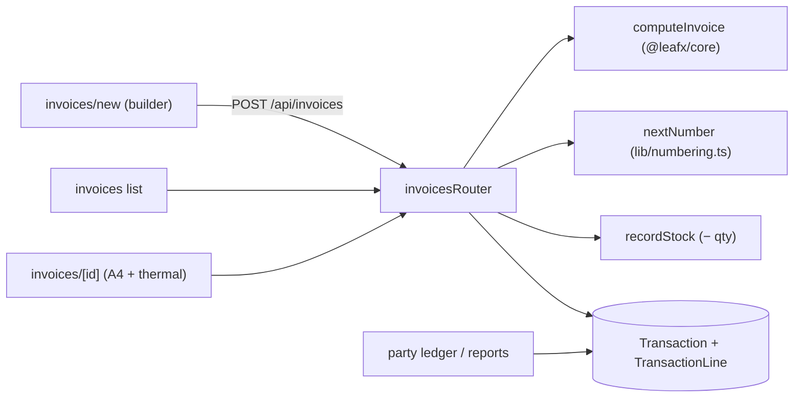
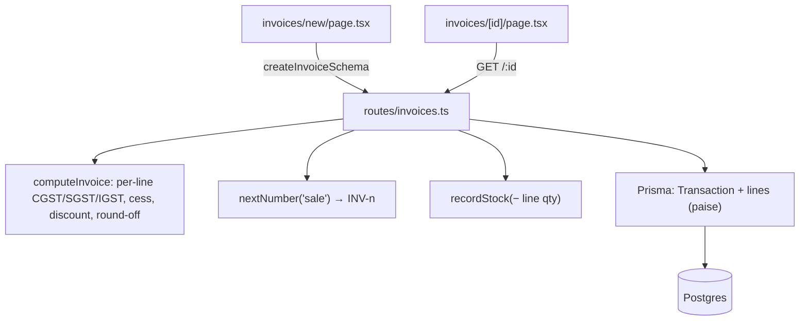
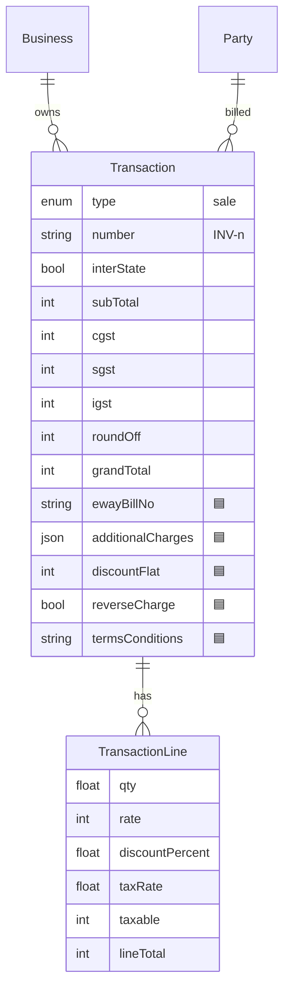
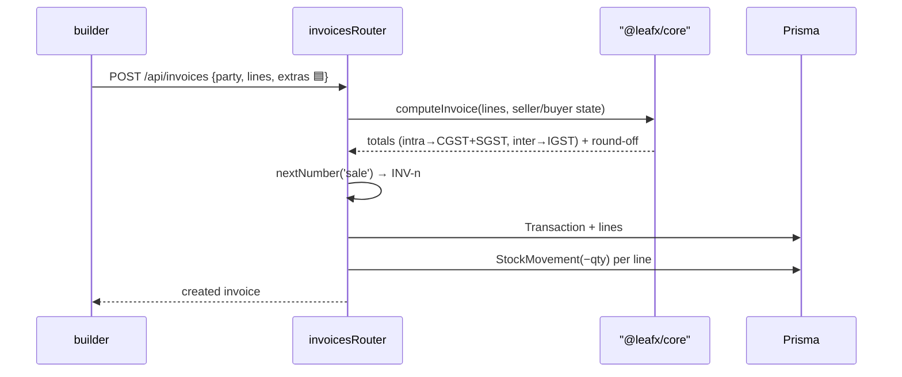

# Sale Invoices

## 1. Purpose
The core billing document. A sale invoice captures party + line items, computes GST-correct totals via the shared tax engine, gets a gap-free number, reduces stock, and posts to the party ledger. Renders to an A4 (Tally-style) and thermal print view.

## 2. Ecosystem

## 3. Architecture

## 4. Data model

## 5. Key flows

## 6. API surface
- `GET /api/invoices` · `GET /api/invoices/:id` · `POST /api/invoices`

## 7. Key files
- `client/web/app/invoices/new/page.tsx`, `app/invoices/page.tsx`, `app/invoices/[id]/page.tsx` (+ `/thermal`)
- `server/api/src/routes/invoices.ts`
- `shared/core/src/tax.ts` (`computeInvoice`) · `shared/types` (`createInvoiceSchema`) · `lib/numbering.ts`

## 8. Status vs Vyapar
✅ GST-correct sale invoice, gap-free numbering, stock + ledger impact, A4 + thermal print · 🟦 shadcn builder, "More options" (e-way/transport/charges/TCS-TDS/reverse-charge/T&C), flat discount, logo/signature on print, theme selection (Milestone 1) · ⬜ e-invoice IRP submission, e-way portal.
