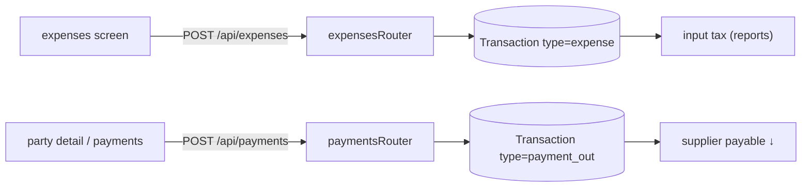
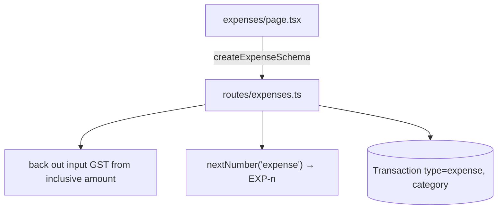
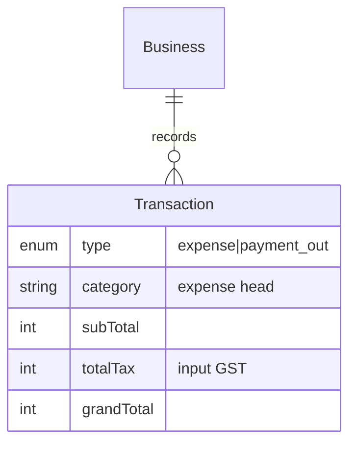

# Expenses & Payments Out

## 1. Purpose
**Expenses** capture business spending (rent, utilities, etc.) as tax-inclusive amounts with input GST backed out and a category. **Payments Out** record money paid to suppliers against payables. Both are `Transaction` rows (`expense`, `payment_out`).

## 2. Ecosystem


## 3. Architecture


## 4. Data model


## 5. Key flows
```mermaid
sequenceDiagram
  participant W as expense form
  participant R as expensesRouter
  participant P as Prisma
  W->>R: POST /api/expenses {category, amount(incl), taxRate}
  R->>R: taxable = amount / (1+rate); tax = amount − taxable
  R->>P: Transaction(type=expense)
  R-->>W: created (input tax recorded)
```

## 6. API surface
- `GET /api/expenses` · `POST /api/expenses`
- `GET /api/payments` · `POST /api/payments` (payment_out via direction)

## 7. Key files
- `client/web/app/expenses/page.tsx`
- `server/api/src/routes/expenses.ts`, `routes/payments.ts`
- `shared/types` → `createExpenseSchema`, `createPaymentSchema`

## 8. Status vs Vyapar
✅ Expense with category + input GST, payment-out with ledger impact · 🟡 `other_income` type exists in enum but has no create path · ⬜ Fixed Assets, recurring expenses, expense attachments.
