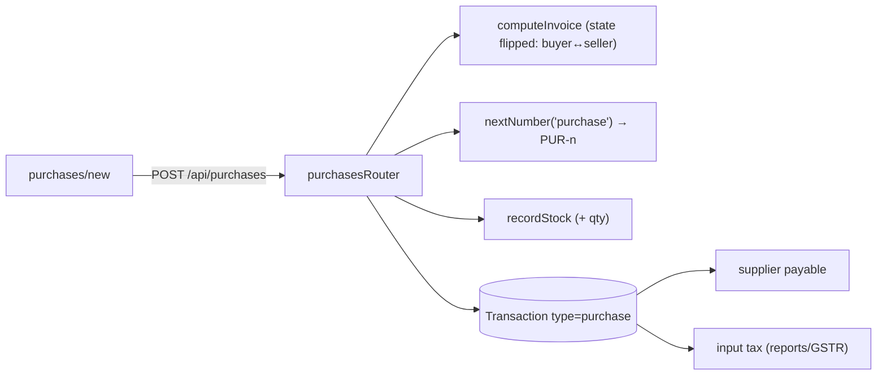
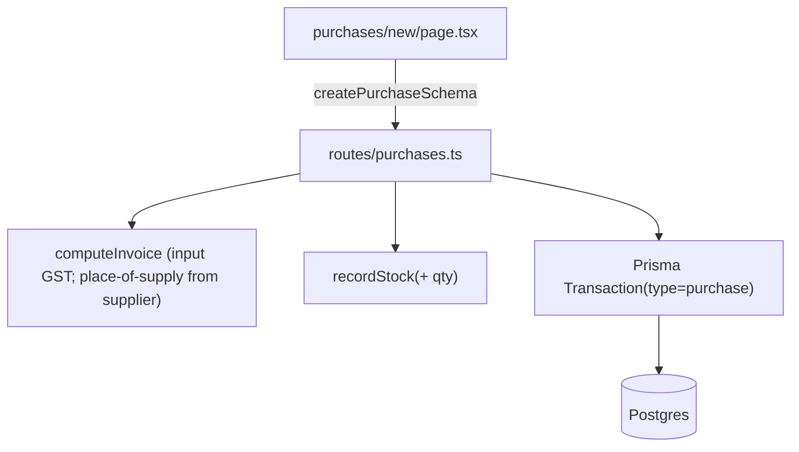
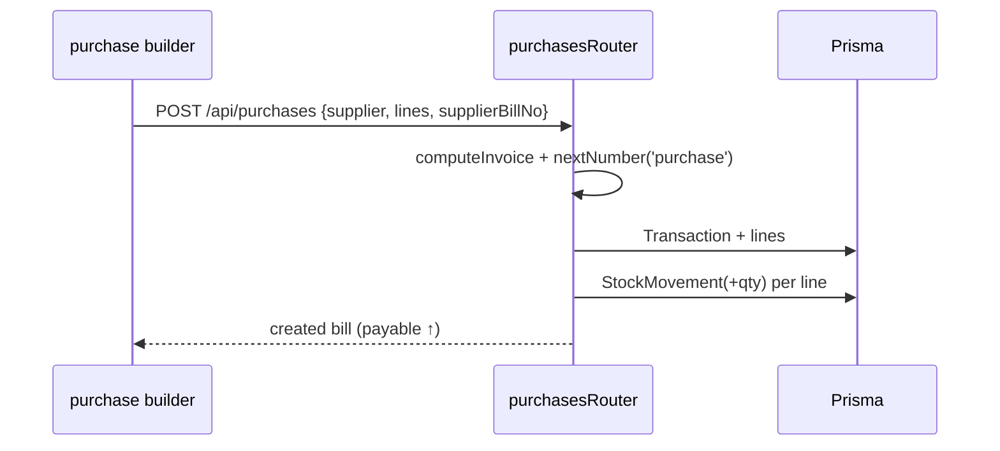

# Purchase Bills

## 1. Purpose
Supplier bills mirror sale invoices in reverse: they record goods/services bought from a supplier, claim **input GST**, increase stock, and post to the supplier's payable ledger. Numbered `PUR-n`.

## 2. Ecosystem

## 3. Architecture

## 4. Data model
Reuses `Transaction`(`type=purchase`) + `TransactionLine`. `referenceNo` holds the supplier's bill number. Tax split stored same as sales but counts as **input** credit.

## 5. Key flows

## 6. API surface
- `GET /api/purchases` · `GET /api/purchases/:id` · `POST /api/purchases`

## 7. Key files
- `client/web/app/purchases/page.tsx`, `app/purchases/new/page.tsx`
- `server/api/src/routes/purchases.ts` · `shared/types` → `createPurchaseSchema`

## 8. Status vs Vyapar
✅ Purchase bill, input GST, stock-in, supplier ledger, numbering · 🟦 shadcn builder, transaction extras where relevant (Milestone 1) · ⬜ purchase-order → bill auto-fill, landed cost.
