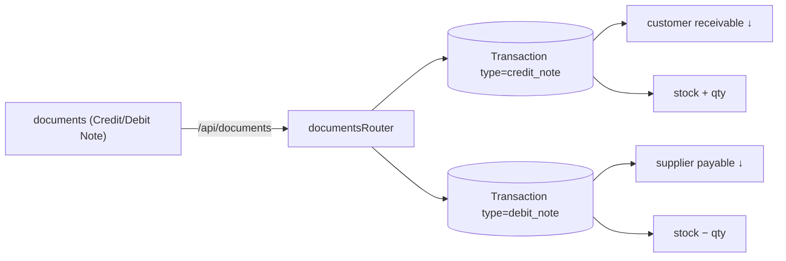
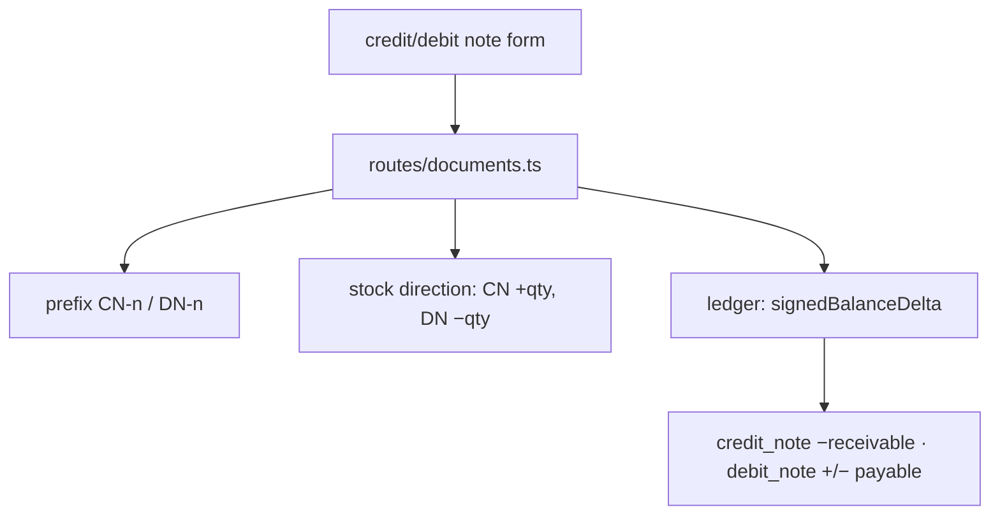
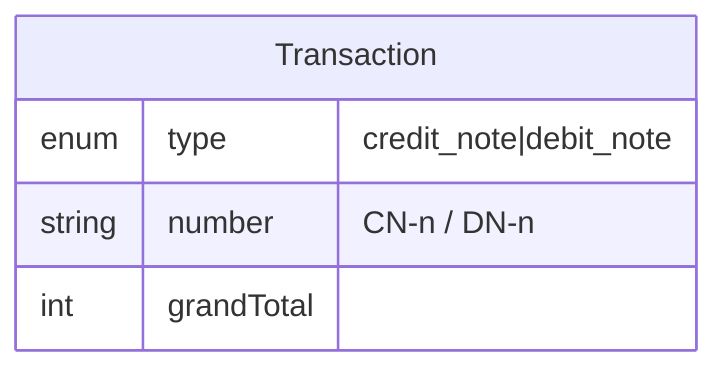
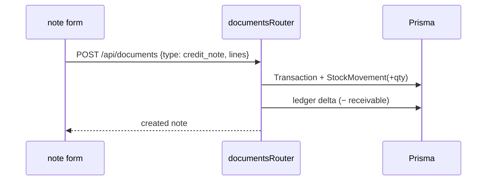

# Credit & Debit Notes

## 1. Purpose
**Credit Note** = sales return (reduces a customer's receivable, stock comes back in). **Debit Note** = purchase return (reduces a supplier's payable, stock goes out). Both are `Transaction` types created through the documents router.

## 2. Ecosystem

## 3. Architecture

## 4. Data model

Ledger signs (see `lib/ledger.ts`): `credit_note` reduces receivable; `debit_note` reduces payable.

## 5. Key flows

## 6. API surface
- `POST /api/documents` (`type = credit_note | debit_note`) · listed via `GET /api/documents?type=`

## 7. Key files
- `client/web/app/documents/page.tsx`
- `server/api/src/routes/documents.ts` · `server/api/src/lib/ledger.ts`

## 8. Status vs Vyapar
✅ Credit/debit notes with stock + ledger reversal, numbering · 🟦 print theme + extras carry-through (Milestone 1) · ⬜ link a note directly to its original invoice/bill line-by-line.
