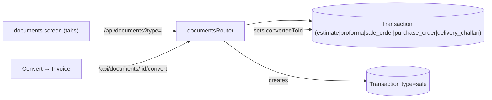
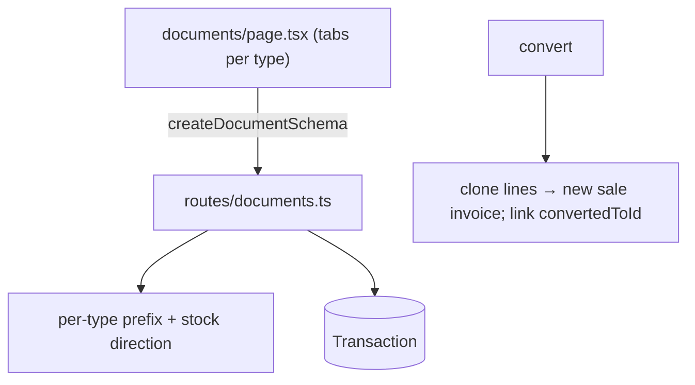
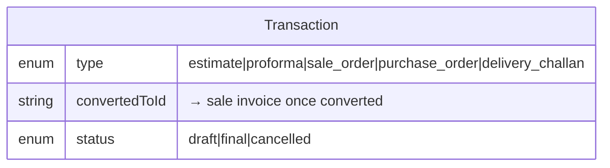
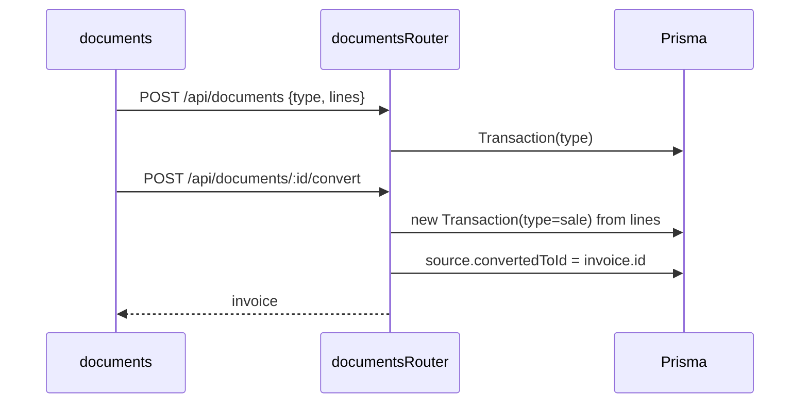

# Estimates, Orders & Delivery Challans

## 1. Purpose
Non-accounting sales documents that precede an invoice: **Estimate/Quotation**, **Proforma Invoice**, **Sale Order**, **Purchase Order**, **Delivery Challan**. They share the `Transaction` model with per-type numbering and can be **converted** into a sale invoice (carrying `convertedToId`).

## 2. Ecosystem

## 3. Architecture

## 4. Data model

Delivery challans may affect stock (goods movement) without accounting impact; estimates/orders do not touch stock or ledger until converted.

## 5. Key flows

## 6. API surface
- `GET /api/documents?type=` · `POST /api/documents` · `POST /api/documents/:id/convert`

## 7. Key files
- `client/web/app/documents/page.tsx`
- `server/api/src/routes/documents.ts` · `shared/types` → `createDocumentSchema`, `documentTypeSchema`

## 8. Status vs Vyapar
✅ All five doc types, per-type numbering, convert-to-invoice · 🟦 enabled-doc-types driven by settings toggles (Milestone 1) · ⬜ order fulfilment tracking, partial conversion.
