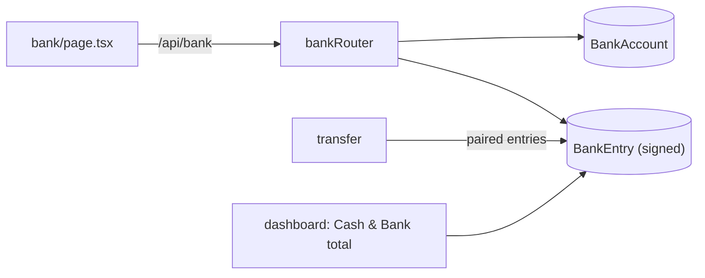
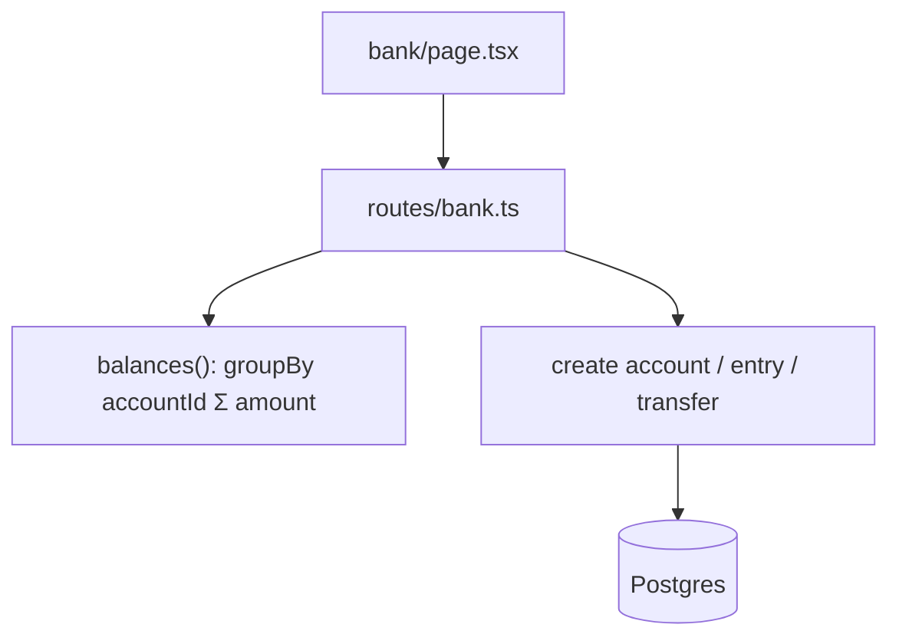
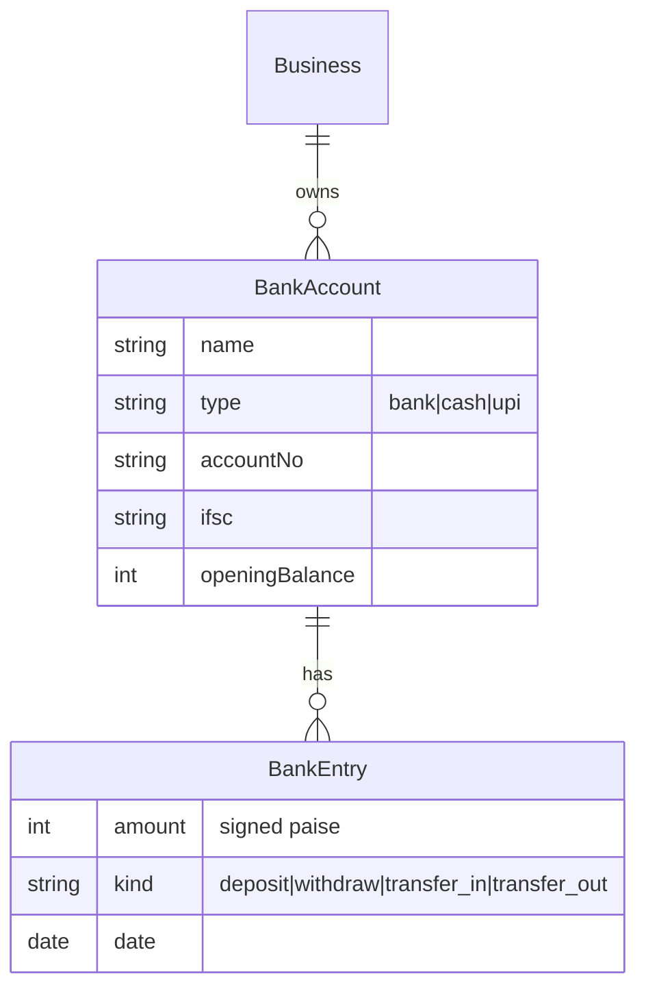
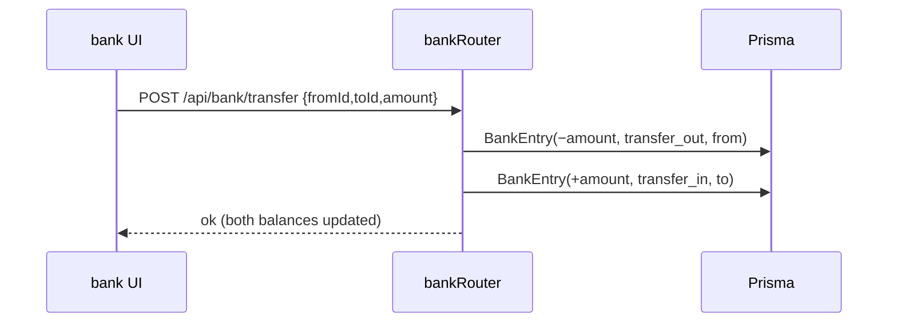

# Bank Accounts & Cash

## 1. Purpose
Tracks money balances across bank/cash/UPI accounts. Balance = `openingBalance + Σ signed BankEntry`. Supports deposits, withdrawals, and transfers between accounts. Cash-in-hand is modeled as a `BankAccount` of type `cash`.

## 2. Ecosystem

## 3. Architecture

## 4. Data model

## 5. Key flows

## 6. API surface
- `GET /api/bank` (accounts + computed balance) · `POST /api/bank` · `POST /api/bank/:id/entry` · `POST /api/bank/transfer`

## 7. Key files
- `client/web/app/bank/page.tsx`
- `server/api/src/routes/bank.ts`

## 8. Status vs Vyapar
✅ Bank/cash/UPI accounts, deposit/withdraw/transfer, dashboard total · 🟡 cash-in-hand is only an account type · 🟦 Cheques + Loan accounts as first-class features → [cheques-and-loans](cheques-and-loans.md) (Milestone 1) · ⬜ bank reconciliation, statement import.
