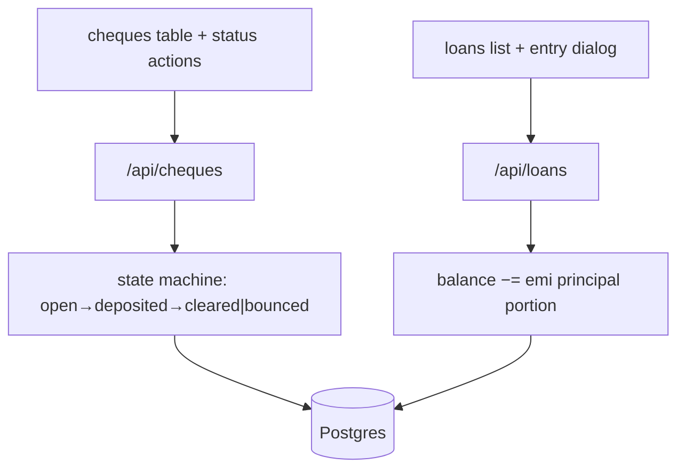
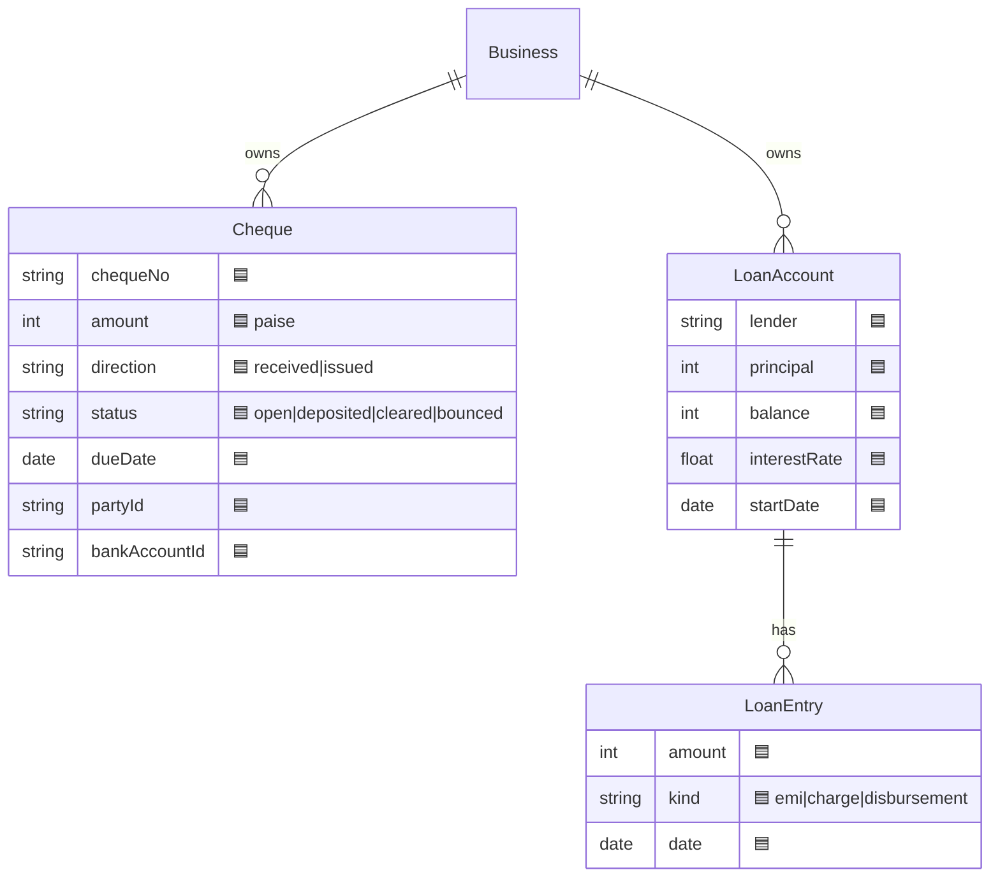
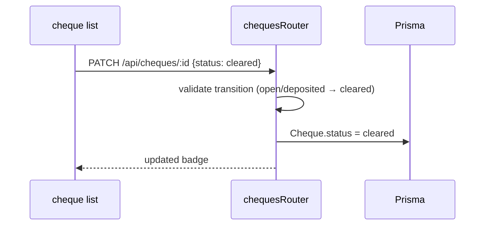

# Cheques & Loan Accounts (Planned — Milestone 1)

## 1. Purpose
Two first-class Cash & Bank features being added in Milestone 1:
- **Cheques** — track received/issued cheques through their lifecycle (open → deposited → cleared → bounced).
- **Loan Accounts** — track borrowings with principal, running balance, interest, and EMI/charge entries.

## 2. Ecosystem
```mermaid
flowchart LR
  ChUI["Cash & Bank → Cheques 🟦"] -->|"/api/cheques"| ChR["chequesRouter 🟦"]
  ChR --> Ch[("Cheque 🟦")]
  Ch -.->|"on clear"| Bank["BankEntry (optional)"]
  LnUI["Cash & Bank → Loans 🟦"] -->|"/api/loans"| LnR["loansRouter 🟦"]
  LnR --> Ln[("LoanAccount 🟦")]
  Ln ||--o{ LnE["LoanEntry 🟦"]:has
```

## 3. Architecture


## 4. Data model


## 5. Key flows


## 6. API surface (planned)
- `GET/POST /api/cheques` · `PATCH /api/cheques/:id` (status)
- `GET/POST /api/loans` · `POST /api/loans/:id/entry`

## 7. Key files (planned)
- `server/api/src/routes/cheques.ts`, `routes/loans.ts` (new)
- `client/web/app/bank/cheques/…`, `app/bank/loans/…` (new, or tabs under bank)
- `server/prisma/schema.prisma` — `Cheque`, `LoanAccount`, `LoanEntry`

## 8. Status vs Vyapar
🟦 Planned in Milestone 1 (broadened scope, Tasks 15) · ⬜ cheque printing, loan amortization schedule, interest auto-posting (M2+).
