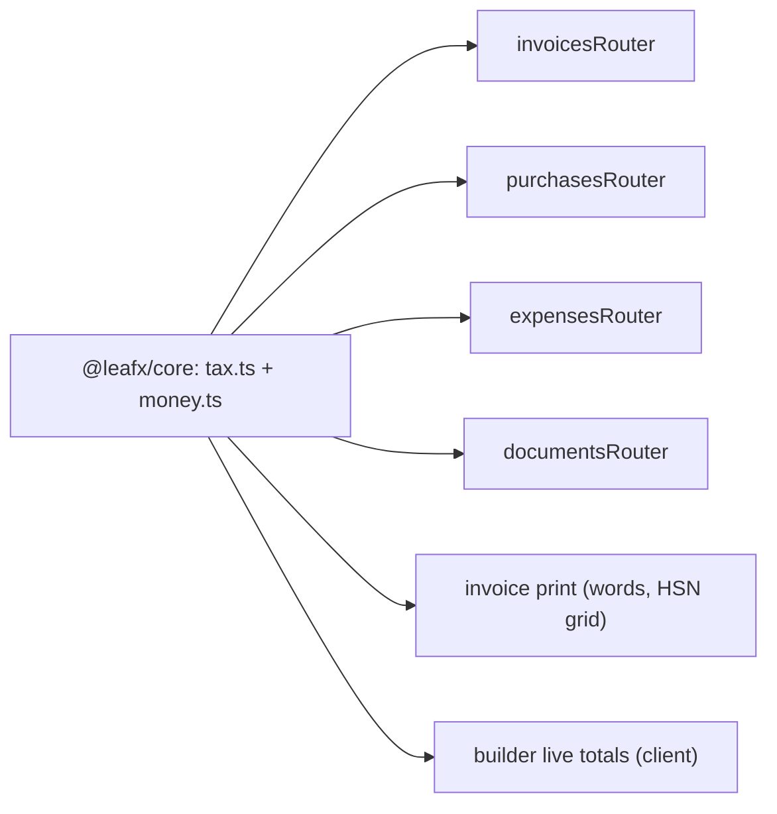
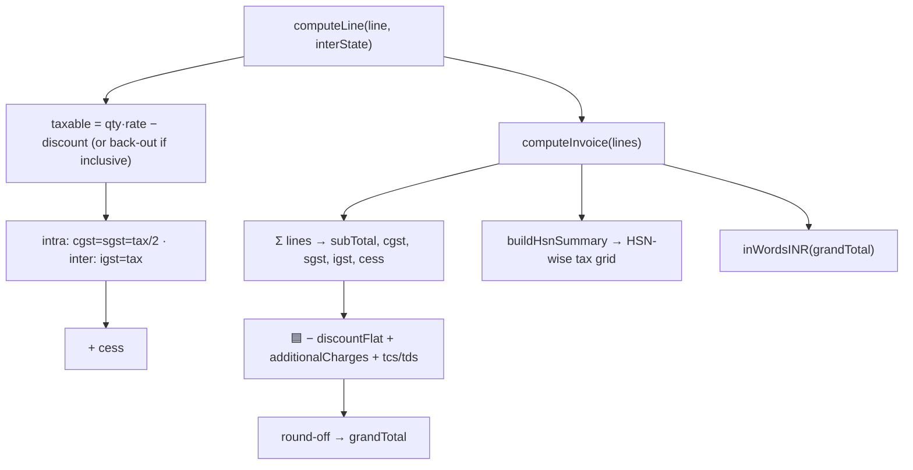
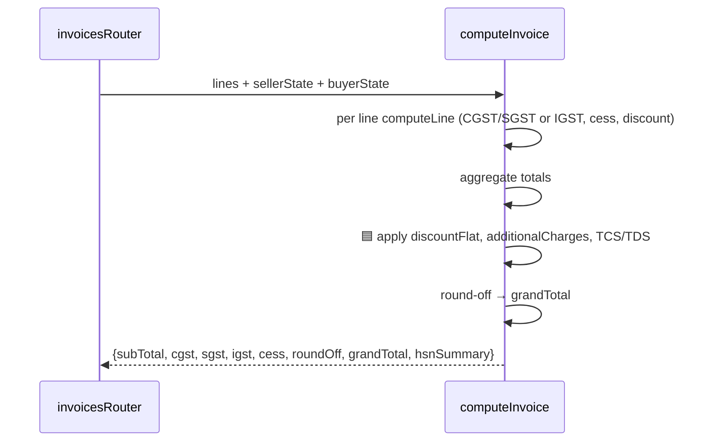

# GST Tax Engine (`@leafx/core`)

## 1. Purpose
The pure, unit-tested calculation core shared by client and server. Computes line-level and invoice-level GST with exact integer-paise math: intra-state → CGST+SGST split, inter-state → IGST; supports discount, cess, tax-inclusive back-calculation, round-off, HSN summary, and amount-in-words. Milestone 1 extends it with flat discount, additional charges, and TCS/TDS.

## 2. Ecosystem

## 3. Architecture

## 4. Data model
No DB — pure functions over line inputs; results are persisted as paise columns on `Transaction`/`TransactionLine` by the routers.

## 5. Key flows

## 6. API surface
Library, not HTTP. Exports: `computeLine`, `computeInvoice`, `computeInvoiceTotals`, `buildHsnSummary`, `formatINR`, `inWordsINR`, `numberToIndianWords`, `rupeesToPaise`.

## 7. Key files
- `shared/core/src/tax.ts`, `shared/core/src/money.ts`
- `shared/core/src/tax.test.ts` (13 golden tests incl. the AVS invoice → ₹48,767)

## 8. Status vs Vyapar
✅ Intra/inter split, inclusive back-calc, discount %, cess, round-off, HSN summary, Indian words · 🟦 flat discount, additional charges, TCS/TDS in the totals pipeline + new tests (Milestone 1, Task 10) · ⬜ composite scheme, MRP-based tax.
