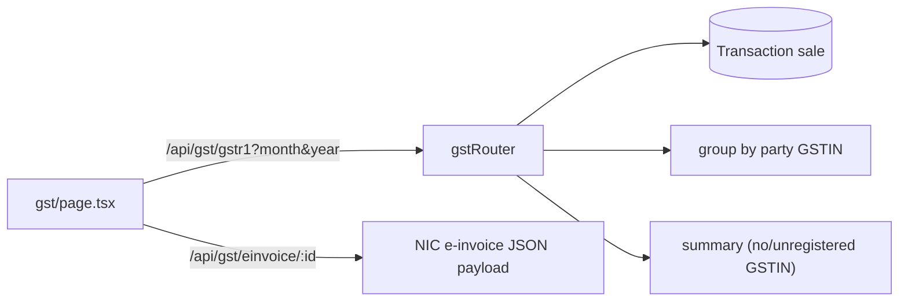
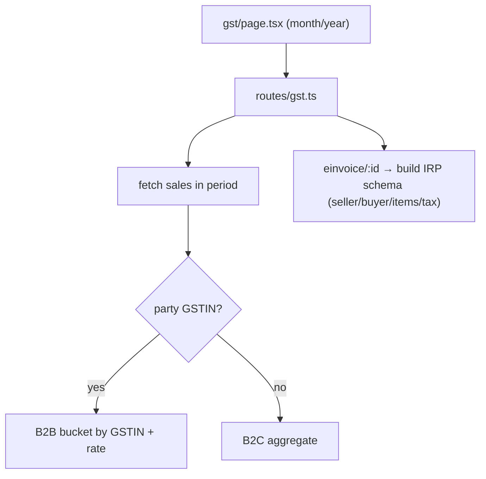
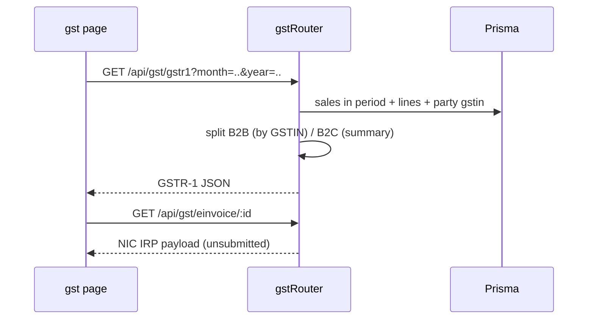

# GSTR-1 & E-Invoice

## 1. Purpose
GST compliance outputs. **GSTR-1** produces the monthly outward-supplies JSON (B2B grouped by counter-party GSTIN, B2C summarised). **E-Invoice** builds the NIC IRP JSON payload for a given invoice (payload only — not yet submitted to the portal).

## 2. Ecosystem

## 3. Architecture

## 4. Data model
Reads `Transaction`(`type=sale`) + lines + party GSTIN + business GSTIN. No new tables. `reverseCharge` currently hardcoded `"N"` in output → 🟦 read the real `Transaction.reverseCharge` field (Task 11).

## 5. Key flows

## 6. API surface
- `GET /api/gst/gstr1?month=&year=` · `GET /api/gst/einvoice/:id`

## 7. Key files
- `client/web/app/gst/page.tsx`
- `server/api/src/routes/gst.ts`

## 8. Status vs Vyapar
✅ GSTR-1 B2B/B2C JSON, e-invoice payload · 🟦 real reverse-charge flag from data (Task 11) · ⬜ GSTR-3B export file, actual IRP/e-way portal submission, GSTR-2A/2B reconciliation.
