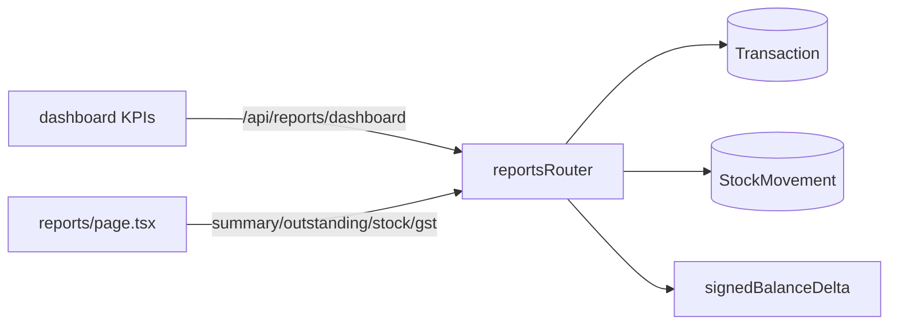
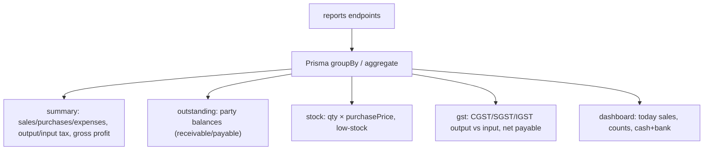
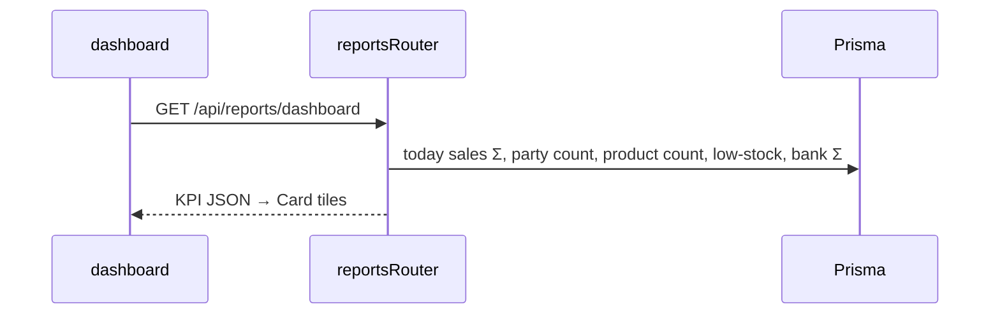

# Reports

## 1. Purpose
Aggregated business insight computed on demand from transactions, stock and ledger: a dashboard KPI feed plus P&L summary, party outstanding, stock valuation, GST (GSTR-3B style), and daybook.

## 2. Ecosystem

## 3. Architecture

## 4. Data model
No tables of its own; reads `Transaction`, `TransactionLine`, `StockMovement`, `Party`, `BankAccount/Entry`.

## 5. Key flows

## 6. API surface
- `GET /api/reports/dashboard` · `/summary` · `/outstanding` · `/stock` · `/gst` · `/daybook`

## 7. Key files
- `client/web/app/reports/page.tsx` · `client/web/components/DashboardMetrics.tsx`
- `server/api/src/routes/reports.ts` · `lib/ledger.ts`, `lib/stock.ts`

## 8. Status vs Vyapar
✅ Dashboard KPIs (live), P&L summary, outstanding, stock valuation, GSTR-3B summary, daybook · ⬜ ageing buckets, item-wise profit, bill-wise settlement, cash-flow, day-book filters/exports (M2+).
