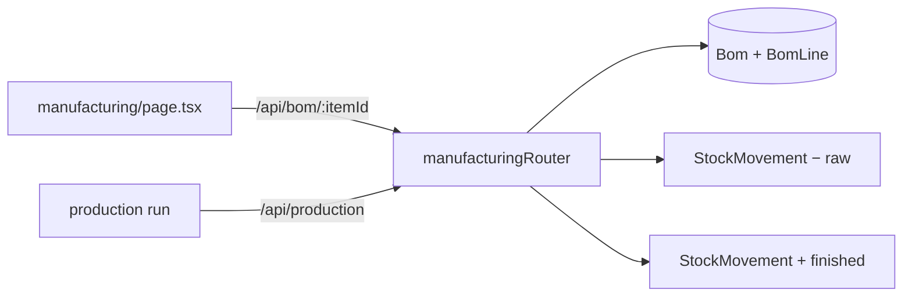
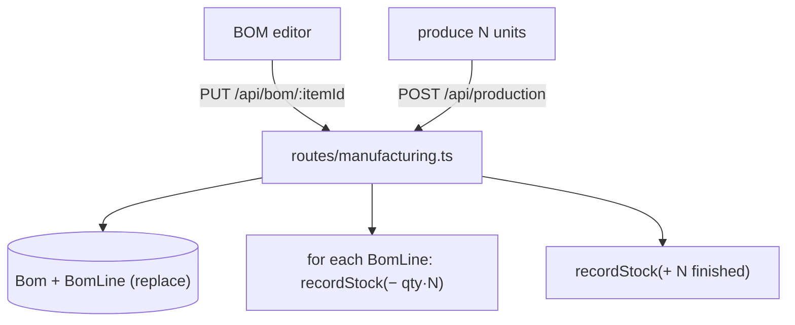
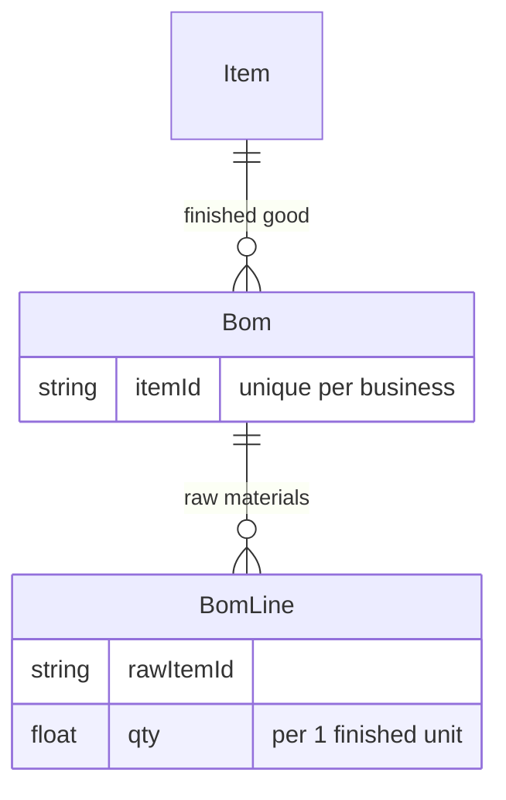
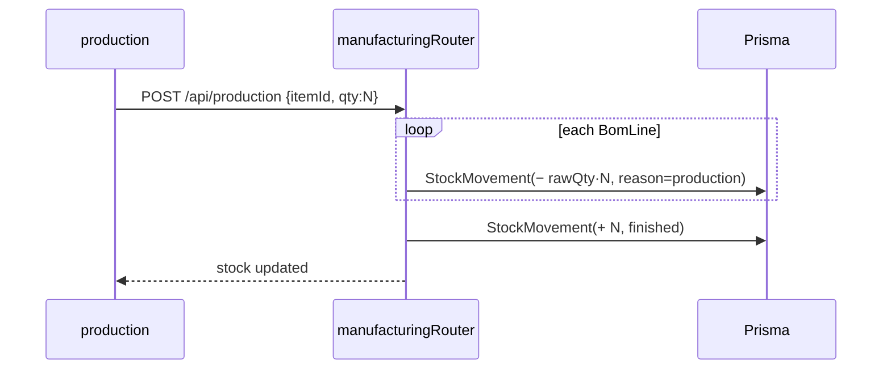

# Manufacturing (BOM & Production)

## 1. Purpose
Light manufacturing: define a **Bill of Materials** (raw items + quantities) for a finished good, then run **production** to consume raw materials and add finished stock — all via signed stock movements.

## 2. Ecosystem

## 3. Architecture

## 4. Data model

## 5. Key flows

## 6. API surface
- `GET /api/bom/:itemId` · `PUT /api/bom/:itemId` (replace lines) · `POST /api/production`
- `GET /api/godowns` · `POST /api/godowns`

## 7. Key files
- `client/web/app/manufacturing/page.tsx`
- `server/api/src/routes/manufacturing.ts` (mounted at `/api`) · `lib/stock.ts`

## 8. Status vs Vyapar
✅ BOM per finished good, production consumes raw + adds finished · ⬜ labour/overhead costing, multi-level BOM, work orders, per-godown production (ties to [stock-and-godowns](../03-items-inventory/stock-and-godowns.md)).
