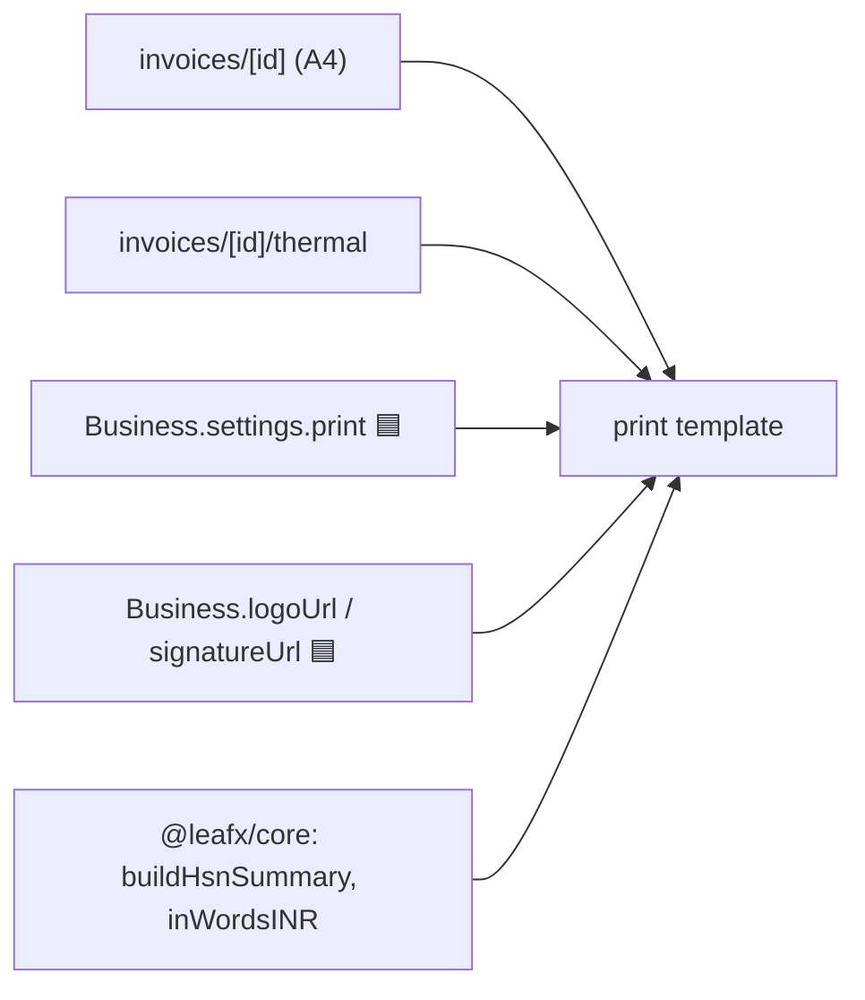
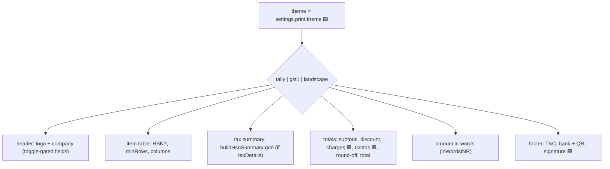
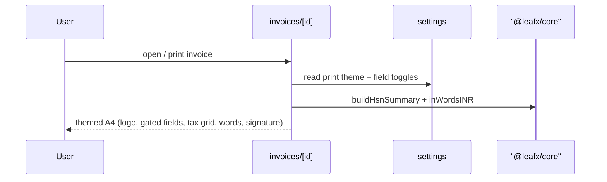

# Print Templates

## 1. Purpose
Renders transactions to printable output: an A4 document (Tally-style dense GST layout, matching the AVS/revachem reference) and a thermal receipt. Milestone 1 adds theme selection, print-field toggles from settings, and branding (logo/signature).

## 2. Ecosystem

## 3. Architecture

## 4. Data model
Reads `Transaction`(+lines), `Business`(branding + bank), `Party`, and `Business.settings.print`. No new tables. Template files hold the HTML/JSX layouts.

## 5. Key flows

## 6. API surface
No dedicated endpoints — pulls invoice via `/api/invoices/:id`, business via `/api/business/current`, settings via `/api/business/current/settings`.

## 7. Key files
- `client/web/app/invoices/[id]/page.tsx` (A4), `app/invoices/[id]/thermal/page.tsx`
- `docs/templates/gst-tally-invoice.html` (reference layout)
- `shared/core/src/money.ts` (`inWordsINR`), `tax.ts` (`buildHsnSummary`)

## 8. Status vs Vyapar
✅ Tally-style A4 + thermal render · 🟦 theme picker (tally + gst1 in M1), print-field toggles, logo + signature, additional charges/TCS/TDS/T&C on print (Tasks 13–14) · ⬜ landscape/extra themes, per-theme color customization, custom transaction names.
