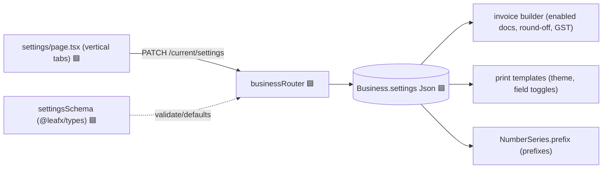
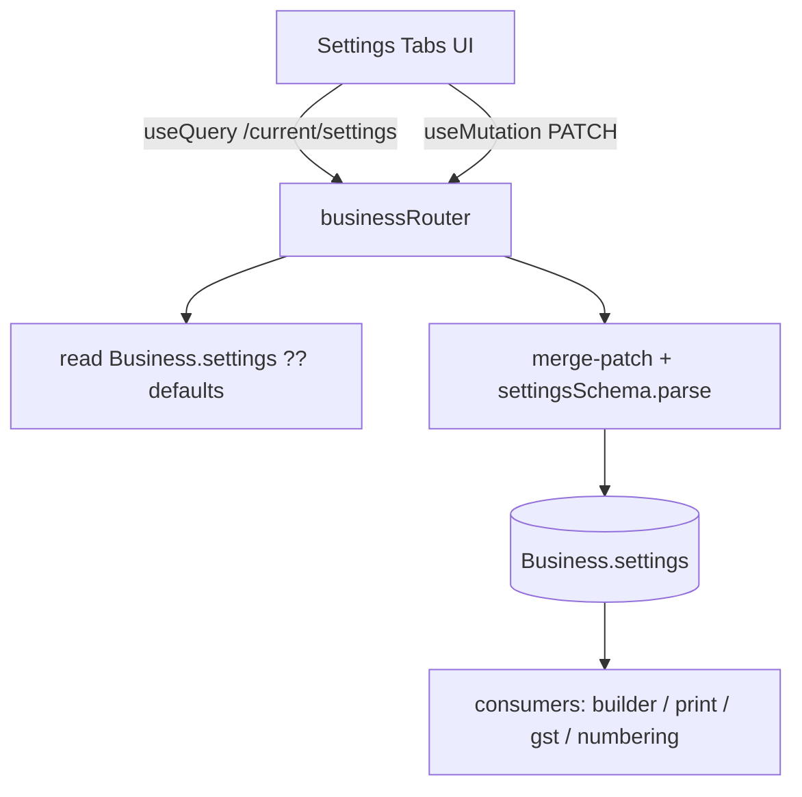
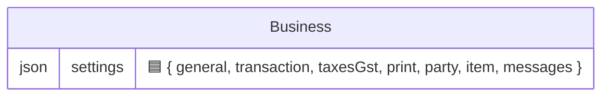

# Settings Layer (Planned — Milestone 1)

## 1. Purpose
The largest missing surface vs Vyapar. A per-firm preferences system covering General, Transaction, Taxes & GST, Print, Party, Item and Transaction-Message tabs. Stored as a single validated JSON blob on `Business.settings` with typed defaults, read by the invoice builder, GST logic, and print templates.

## 2. Ecosystem


## 3. Architecture


## 4. Data model

Shape defined by `settingsSchema` in `shared/types` (see the full toggle inventory in the plan's Appendix A). `[F]` keys are honored in M1; the rest persist for later wiring.

## 5. Key flows
```mermaid
sequenceDiagram
  participant W as settings tab
  participant R as businessRouter
  participant P as Prisma
  W->>R: PATCH /api/business/current/settings {taxesGst:{enableGst:true}, ...}
  R->>R: merge into existing settings; settingsSchema.parse (defaults)
  R->>P: update Business.settings
  R-->>W: normalized settings
  Note over W: invoice builder & print now read new values
```

## 6. API surface (planned)
- `GET /api/business/current/settings` — normalized settings (defaults applied)
- `PATCH /api/business/current/settings` — merge-patch + re-validate

## 7. Key files (planned)
- `client/web/app/settings/page.tsx` — vertical-tab layout (General/Transaction/Taxes&GST/Print/Party/Item/Messages)
- `server/api/src/routes/business.ts` — settings endpoints
- `shared/types/src/index.ts` — `settingsSchema` + defaults

## 8. Status vs Vyapar
🟦 Planned in Milestone 1 (Tasks 6 + 12). Functional `[F]` toggles: GST enable, HSN, round-off, enabled doc types, place of supply, TCS/TDS, print theme + field toggles, shipping address, item stock/low-stock, prefixes · ⬜ passcode lock, audit trail, transaction-message automation, multi-currency (stored-but-inert or M2+).
