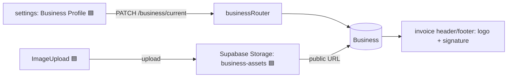
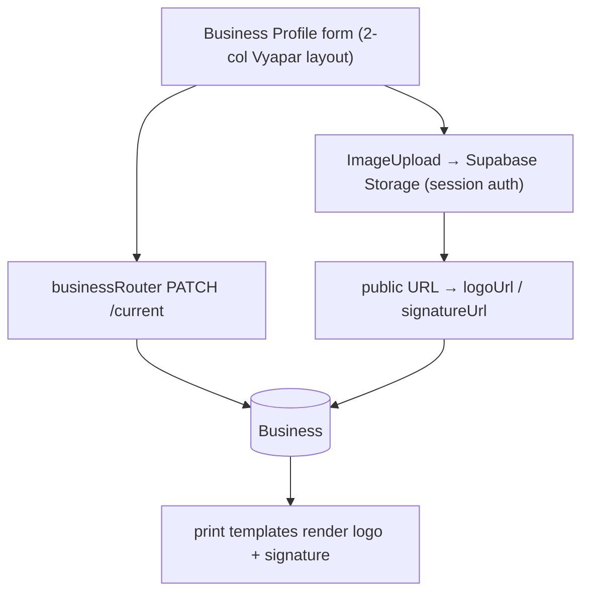
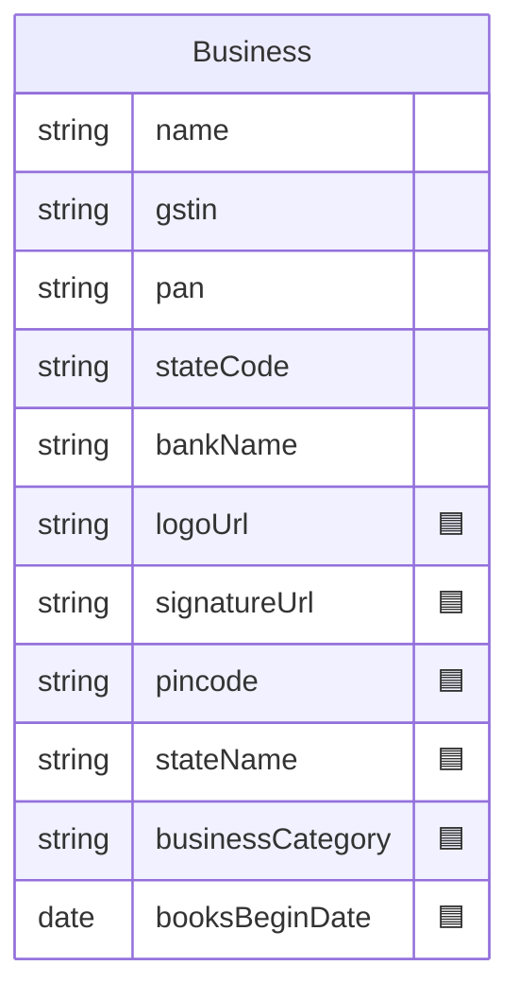
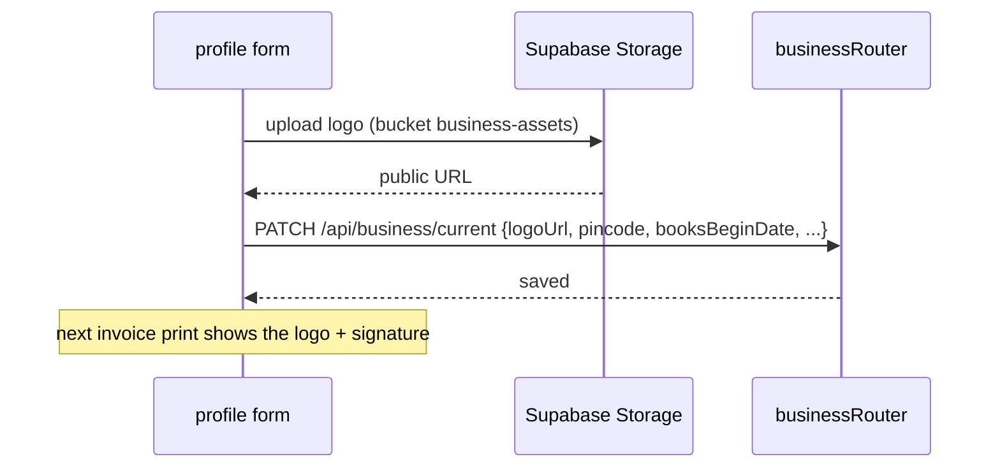

# Business Profile & Branding

## 1. Purpose
The firm's identity used across the app and on printed documents: name, GSTIN/PAN, contact, address, state, and — added in Milestone 1 — **logo**, **signature**, pincode, business type/category, and account-books beginning date. Images are stored in Supabase Storage.

## 2. Ecosystem

## 3. Architecture

## 4. Data model

## 5. Key flows

## 6. API surface
- `GET /api/business/current` · `PATCH /api/business/current` (extended fields)
- Image upload: direct browser → Supabase Storage `business-assets` (public URL persisted)

## 7. Key files
- `client/web/app/settings/page.tsx` (Business Profile tab) · `client/web/components/image-upload.tsx` (🟦)
- `server/api/src/routes/business.ts`
- `server/prisma/schema.prisma` — `Business` branding fields

## 8. Status vs Vyapar
✅ Name, GSTIN/PAN, state code, contact, address, bank details · 🟦 logo, signature, pincode, state name, business type/category, books-begin date + on-invoice rendering (Task 13) · ⬜ multiple templates per firm, watermark.
