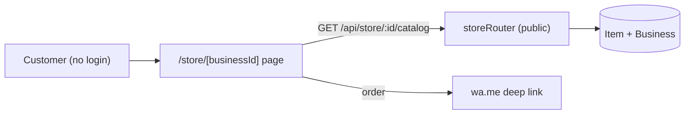
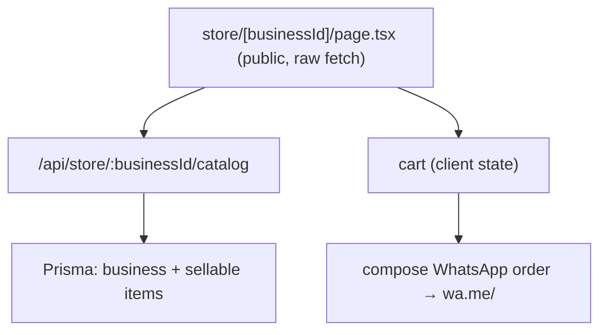
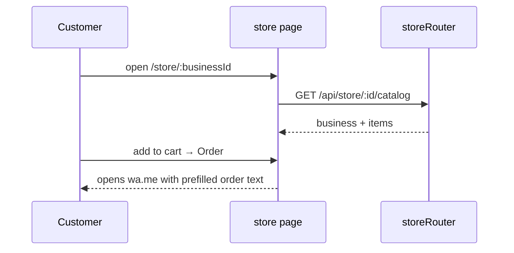

# Online Store

## 1. Purpose
A public, no-auth storefront per business that exposes the item catalog so customers can browse and place an order via WhatsApp. Served under `/store/[businessId]` and backed by a public API route.

## 2. Ecosystem

## 3. Architecture

## 4. Data model
Read-only projection of `Business` (name/phone) + `Item` (name, price, image 🟦). No orders table — checkout hands off to WhatsApp.

## 5. Key flows

## 6. API surface
- `GET /api/store/:businessId/catalog` (public)

## 7. Key files
- `client/web/app/store/[businessId]/page.tsx` (public route, no shell)
- `server/api/src/routes/store.ts`

## 8. Status vs Vyapar
✅ Public catalog + WhatsApp order handoff · 🟦 item images surface once added (Task 8) · ⬜ real cart/checkout, order capture into transactions, payment links, storefront theming (M2+).
