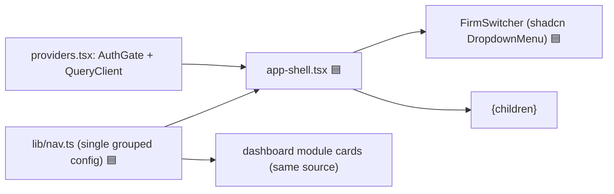
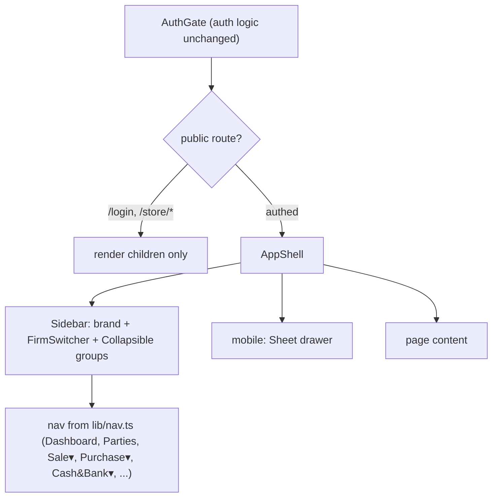
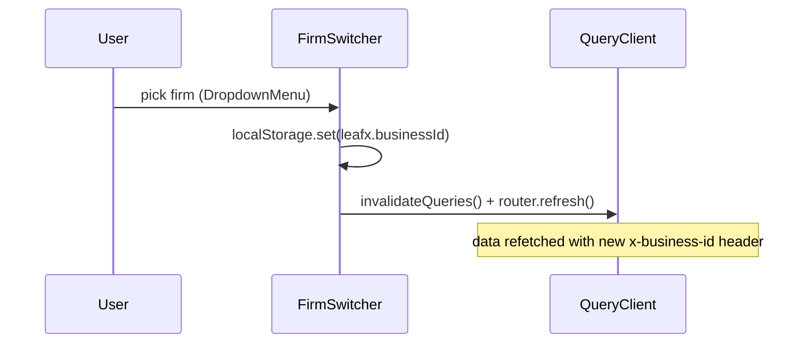

# App Shell & Navigation

## 1. Purpose
The persistent authenticated layout: a left sidebar (branding, firm switcher, grouped nav, user footer) with a mobile drawer. Milestone 1 rebuilds the flat 13-item nav into a **grouped, collapsible sidebar** (mirroring Vyapar's sub-menus) driven by a single nav config, using shadcn primitives.

## 2. Ecosystem

## 3. Architecture

## 4. Data model
No DB. Nav config is a typed structure in `lib/nav.ts` (groups → items → {href, label, icon}). Firm selection persisted in `localStorage["leafx.businessId"]`.

## 5. Key flows
Firm switch without hard reload (planned):

## 6. API surface
- `GET /api/businesses` (firm list) · consumed by FirmSwitcher.

## 7. Key files
- `client/web/app/providers.tsx` (AuthGate — keep auth, delegate layout)
- `client/web/components/app-shell.tsx` (🟦 new) · `client/web/lib/nav.ts` (🟦 new)
- `client/web/app/firm-switcher.tsx` · `client/web/app/page.tsx` (dashboard from same nav)

## 8. Status vs Vyapar
✅ Persistent sidebar + mobile drawer, active states, firm switcher (native select + reload today) · 🟦 grouped collapsible nav, single nav source, shadcn DropdownMenu switcher, no hard reload, lucide icons (Task 3) · ⬜ collapsible-to-rail, command palette, breadcrumbs.
