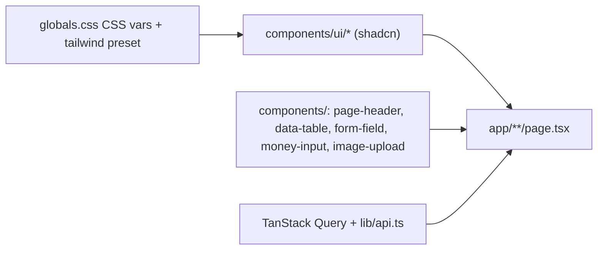
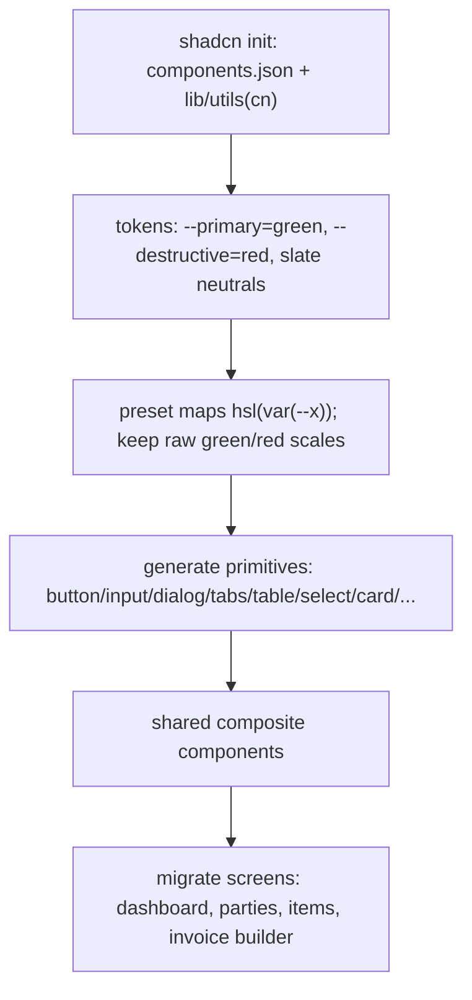
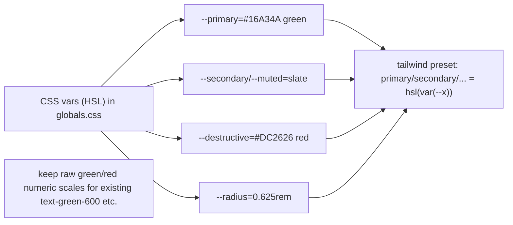
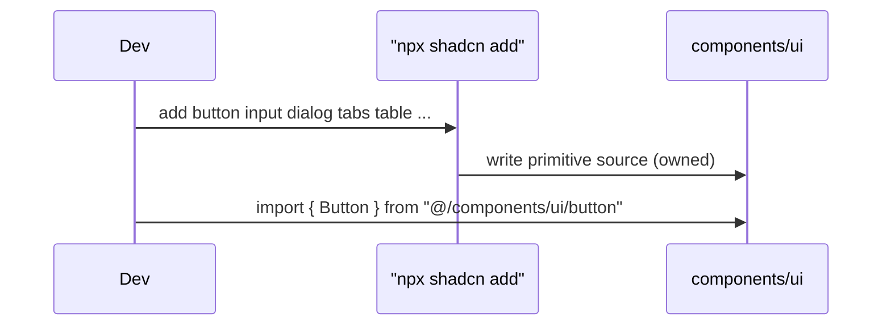

# UI Architecture (shadcn/ui)

## 1. Purpose
The frontend design system. Migrating from hand-rolled Tailwind (repeated inline classes, `window.prompt` dialogs, inline SVGs) to **shadcn/ui** primitives (Radix + CVA + lucide) themed to the Leafx green brand — accessible, consistent, owned-in-repo components.

## 2. Ecosystem

## 3. Architecture

## 4. Token reconciliation

Collision note: the preset currently defines `primary`/`secondary` as hex objects — replaced with the CSS-var form so shadcn components render green by default; audit the few `bg-primary`/`bg-secondary` usages during migration.

## 5. Key flows
Component consumption:

## 6. API surface
n/a (frontend only).

## 7. Key files
- `client/web/components.json` (🟦), `client/web/lib/utils.ts` (🟦 `cn`)
- `client/web/app/globals.css` (tokens), `shared/config/tailwind-preset.js`
- `client/web/components/ui/*` (🟦 generated), `client/web/components/*` (composites)

## 8. Status vs Vyapar
🟦 Milestone 1 foundation + shell + key screens (Tasks 1–2 foundation/shell, 4 composites, 5/7/8/9 screens). Remaining ~15 screens follow the established pattern incrementally · ⬜ dark-mode toggle, storybook, full-page migration (M2).
