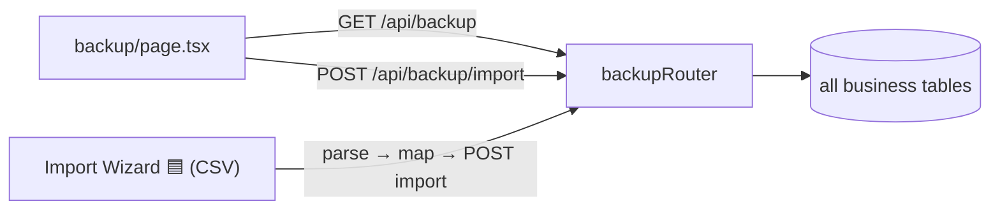
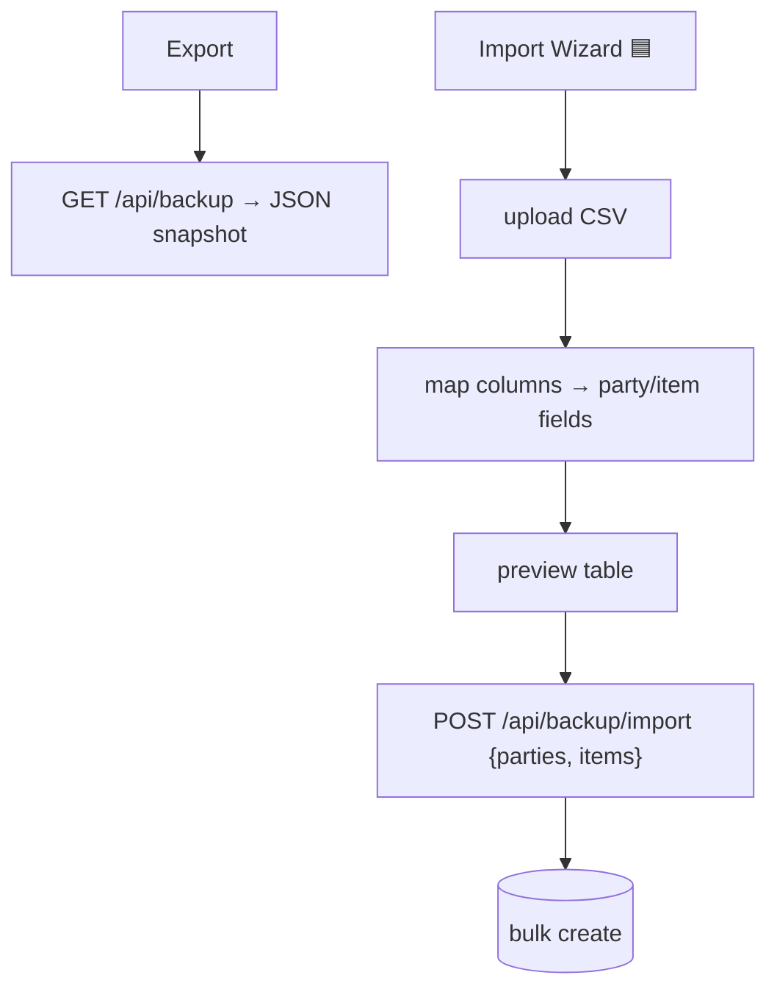

# Backup & Import

## 1. Purpose
Data portability: export a full JSON snapshot of a firm's data, and bulk-import parties/items from arrays. Milestone 1 adds guided CSV **import wizards** (upload → map columns → preview → import) for parties and items.

## 2. Ecosystem


## 3. Architecture


## 4. Data model
No dedicated tables — reads/writes existing `Party`, `Item` (and snapshot of all business tables for export).

## 5. Key flows
```mermaid
sequenceDiagram
  participant W as Import Wizard
  participant R as backupRouter
  participant P as Prisma
  W->>W: parse CSV → rows
  W->>W: map columns → schema fields; preview
  W->>R: POST /api/backup/import {items:[...]}
  R->>P: createMany (scoped to business)
  R-->>W: created counts
```

## 6. API surface
- `GET /api/backup` — full JSON snapshot · `POST /api/backup/import` — bulk create parties/items

## 7. Key files
- `client/web/app/backup/page.tsx`
- `server/api/src/routes/backup.ts`
- (🟦) import-wizard dialog component + CSV parsing

## 8. Status vs Vyapar
✅ JSON export, bulk parties/items import · 🟦 CSV import wizard with column mapping + preview (Task 17) · ⬜ scheduled auto-backup, Google Drive backup, Import/Export to Tally, restore-from-snapshot UI (M2+).
