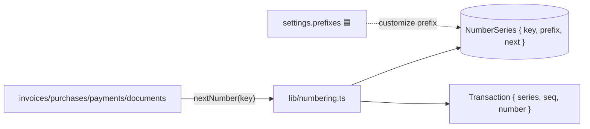
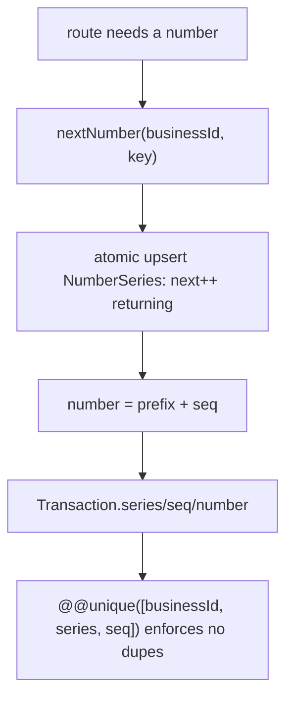
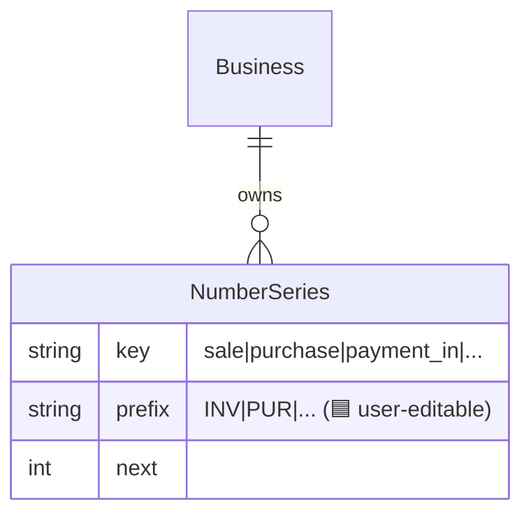
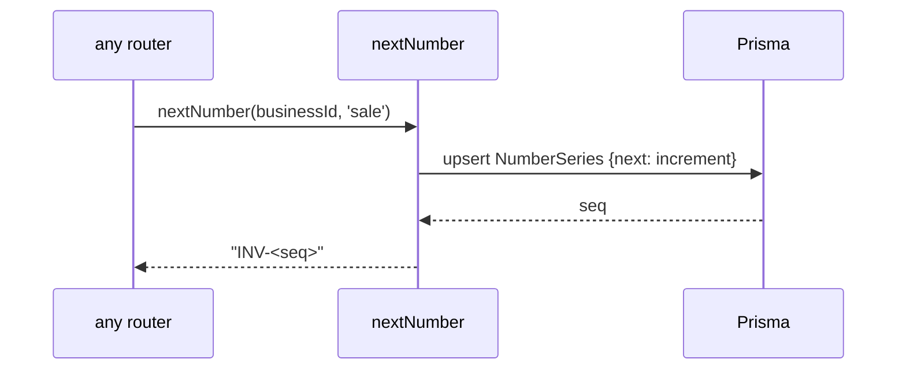

# Numbering Series

## 1. Purpose
Gap-free, per-firm, per-document-type sequential numbering (INV-1, INV-2, PUR-1, …). Guarantees uniqueness via an atomic counter and a DB uniqueness constraint on each transaction's `(businessId, series, seq)`.

## 2. Ecosystem

## 3. Architecture

## 4. Data model

Prefixes are currently code-hardcoded per doc type; Milestone 1 lets settings map `NumberSeries.prefix`.

## 5. Key flows

## 6. API surface
Library, not HTTP. Prefix customization arrives via settings (`PATCH /business/current/settings`).

## 7. Key files
- `server/api/src/lib/numbering.ts`
- `server/prisma/schema.prisma` — `NumberSeries`, `Transaction` unique constraint

## 8. Status vs Vyapar
✅ Gap-free per-series numbering, uniqueness enforced · 🟦 user-editable prefixes via settings (Task 12) · ⬜ financial-year reset, custom formats/padding, per-firm invoice-no rules.
