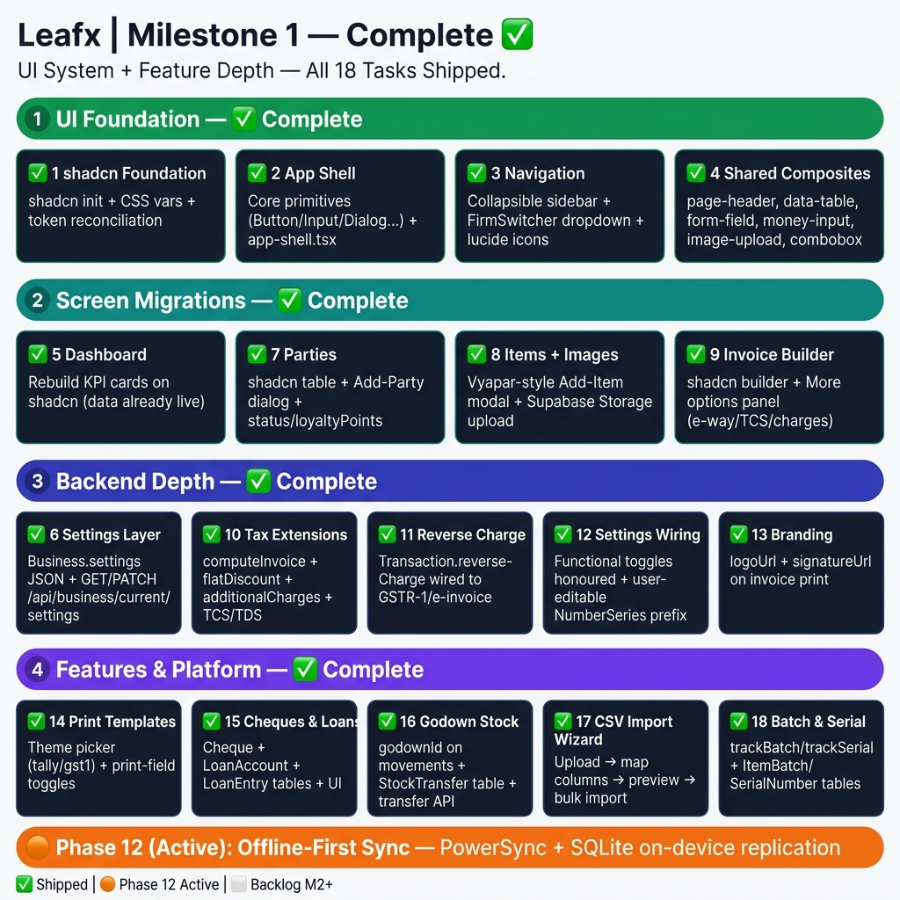

# Milestone 1 — UI System + Feature Depth

> **Status:** ✅ **Complete.** The foundation milestone — **Phases 0–16** in
> [`PLAN.md`](../PLAN.md) — is shipped: multi-tenant core, the full billing loop, purchases,
> inventory, all document types, cash & bank, reports, GST outputs, manufacturing, POS,
> backup, and the online store all work end-to-end.
>
> **Milestone 1 is fully shipped.** All 18 tasks in the table below are complete.
> Schema fields (cheques, loans, settings JSON, branding, godown-aware stock, batch/serial)
> are in the live Prisma schema. shadcn/ui components, composites, settings wiring, and
> import wizard are all implemented. The 🟦 markers in feature docs can now be read as ✅.

---

## 0. Roadmap at a glance

All 18 tasks are shipped across four delivery bands:

- **UI Foundation** — `1` shadcn foundation ✅ · `2` app shell ✅ · `3` navigation ✅ · `4` shared composites ✅
- **Screen Migrations** — `5` dashboard ✅ · `7` parties ✅ · `8` items + images ✅ · `9` invoice builder ✅
- **Backend Depth** — `6` settings layer ✅ · `10` tax extensions ✅ · `11` reverse charge ✅ · `12` settings wiring ✅ · `13` branding ✅
- **Features & Platform** — `14` print templates ✅ · `15` cheques & loans ✅ · `16` godown stock ✅ · `17` CSV import ✅ · `18` batch & serial ✅

**Cleanup (fold into Task 3):** resolve the vestigial email-verification UI flagged in
[authentication §6b](01-auth-tenancy/authentication.md) — the login page still shows a *"Confirm your
email"* screen and calls a non-existent `POST /api/auth/resend` (404). Align it to the pre-confirmed
signup: remove the check-email branch + `/resend` call (or, if verification is wanted again, add the
endpoint and flip `email_confirm:false`).

---

## 1. Goal

Turn the functionally-complete-but-hand-rolled app into a polished, Vyapar-depth product:

1. **Adopt a real design system** — migrate from repeated inline Tailwind + `window.prompt`
   dialogs + inline SVGs to **shadcn/ui** primitives (Radix + CVA + lucide) on the Leafx green theme.
2. **Add the missing depth** vs Vyapar — a per-firm **settings layer**, **branding** (logo/signature
   on print), **tax-engine extensions** (flat discount, additional charges, TCS/TDS), **cheques & loans**,
   **godown-aware stock**, a **CSV import wizard**, and optional **batch/serial** tracking.

Each task is independently shippable and additive. Schema changes are nullable/defaulted so
`prisma db push` stays non-destructive.

---

## 2. Task plan

Legend: ✅ shipped · 🟡 partial · ⬜ deferred to M2.
"Doc" links the primary architecture doc(s) the task delivers against.

| # | Task | Delivers | Doc |
|---|---|---|---|
| **1** | ✅ shadcn foundation | `shadcn init` (`components.json`, `lib/utils.ts` `cn`), token reconciliation — HSL CSS vars in `globals.css` (`--primary` green, `--destructive` red, slate neutrals, `--radius`) + preset mapped to `hsl(var(--x))`; keep raw green/red scales | [ui-architecture-shadcn](14-ui-frontend/ui-architecture-shadcn.md) |
| **2** | ✅ App shell | Core primitives generated (button/input/dialog/tabs/table/select/card/…); `components/app-shell.tsx` extracted from `providers.tsx` | [ui-architecture-shadcn](14-ui-frontend/ui-architecture-shadcn.md) · [app-shell-navigation](14-ui-frontend/app-shell-navigation.md) |
| **3** | ✅ Navigation | Grouped, collapsible sidebar with `firm-switcher.tsx` + `FirmSwitcher` DropdownMenu; lucide icons throughout | [app-shell-navigation](14-ui-frontend/app-shell-navigation.md) · [multi-firm-tenancy](01-auth-tenancy/multi-firm-tenancy.md) |
| **4** | ✅ Shared composites | `page-header`, `data-table`, `form-field`, `money-input`, `image-upload`, `combobox` composite components shipped | [ui-architecture-shadcn](14-ui-frontend/ui-architecture-shadcn.md) |
| **5** | ✅ Dashboard migration | Home dashboard rebuilt on shadcn cards (data live via `/api/reports/dashboard`) | [reports](09-reports/reports.md) · [app-shell-navigation](14-ui-frontend/app-shell-navigation.md) |
| **6** | ✅ Settings layer (backend) | `Business.settings` JSON + `settingsSchema` in `@leafx/types`; `GET`/`PATCH /api/business/current/settings` (merge-patch + re-validate) shipped | [settings-layer](11-settings/settings-layer.md) |
| **7** | ✅ Parties migration | shadcn table + Add-Party dialog shipped; `status`, `loyaltyPoints` fields in schema | [parties](02-parties/parties.md) |
| **8** | ✅ Items migration + images | Vyapar-style Add-Item modal with Pricing/Stock tabs; `itemCode`, `wholesalePrice`, `imageUrl`; item image upload → Supabase Storage (`business-assets`) | [items](03-items-inventory/items.md) · [online-store](13-online-store/online-store.md) |
| **9** | ✅ Invoice builder migration | shadcn sale-invoice builder + **"More options"** (e-way/transport/charges/TCS-TDS/reverse-charge/T&C, flat discount) | [sale-invoices](04-sales/sale-invoices.md) |
| **10** | ✅ Tax-engine extensions | `computeInvoice` has flat discount, additional charges, TCS/TDS in the totals pipeline + golden tests | [gst-tax-engine](08-gst-tax/gst-tax-engine.md) |
| **11** | ✅ Real reverse-charge flag | GSTR-1 / e-invoice payloads read `Transaction.reverseCharge` (not hardcoded `"N"`) | [gstr1-einvoice](08-gst-tax/gstr1-einvoice.md) |
| **12** | ✅ Settings wiring + prefixes | Functional `[F]` toggles honoured in builder/gst/numbering; user-editable `NumberSeries.prefix` via settings | [settings-layer](11-settings/settings-layer.md) · [numbering-series](15-platform/numbering-series.md) |
| **13** | ✅ Business profile & branding | `logoUrl`, `signatureUrl`, `pincode`, `stateName`, `businessCategory`, `booksBeginDate` on `Business`; logo + signature on invoice print | [business-profile-branding](12-branding/business-profile-branding.md) |
| **14** | ✅ Print templates | Theme picker (`tally` + `gst1`), print-field toggles from settings, additional charges / TCS-TDS / T&C on printed doc | [print-templates](11-settings/print-templates.md) |
| **15** | ✅ Cheques & Loans | `Cheque`, `LoanAccount`, `LoanEntry` tables + `/api/cheques`, `/api/loans` routes + Cash & Bank UI (cheque lifecycle state machine, loan balance/EMI entries) | [cheques-and-loans](07-cash-bank/cheques-and-loans.md) |
| **16** | ✅ Godown-aware stock | `godownId` on `StockMovement`; `StockTransfer` table + `/api/godowns/transfer` (paired ± movements) | [stock-and-godowns](03-items-inventory/stock-and-godowns.md) |
| **17** | ✅ CSV import wizard | Guided upload → map columns → preview → import for parties & items; `import-wizard.tsx` composite component | [backup-import](15-platform/backup-import.md) |
| **18** | ✅ Batch & serial tracking | `Item.trackBatch`/`trackSerial` + `ItemBatch`, `SerialNumber` tables in schema + capture in invoice/purchase lines | [batch-serial-tracking](03-items-inventory/batch-serial-tracking.md) |

**Remaining screen migrations** (purchases, expenses, documents, payments, bank, GST, POS,
manufacturing, backup) follow the pattern established in Tasks 4–9 incrementally; POS additionally
gets barcode input + quick-tender polish. These are not separately numbered.

---

## 3. Data-model additions (all 🟦, additive)

Consolidated from the per-feature docs; see [data-model-erd.md](00-overview/data-model-erd.md) for the ERD.

| Model | New fields / tables |
|---|---|
| **Business** | `logoUrl, signatureUrl, pincode, stateName, businessCategory, booksBeginDate, settings Json` |
| **Item** | `itemCode, wholesalePrice, imageUrl, taxOnMrp, trackBatch, trackSerial` |
| **StockMovement** | `godownId` |
| **Party** | `status, loyaltyPoints` |
| **Transaction** | `ewayBillNo, transporterName, vehicleNo, transportDistanceKm, additionalCharges Json, discountFlat, tcsRate, tcsAmount, tdsRate, tdsAmount, reverseCharge, termsConditions` |
| **New tables** | `Cheque`, `LoanAccount`, `LoanEntry`, `StockTransfer`, `ItemBatch`, `SerialNumber` |

---

## Appendix A — Settings toggle inventory

Shape of `Business.settings`, validated by `settingsSchema` in `shared/types`. Tabs mirror
Vyapar's settings screen. `[F]` = **functional in M1** (read by builder / GST / print / numbering);
unmarked keys persist now and are wired later.

### `general`
- `businessName`, `logo`, `signature` (branding — Task 13)
- `financialYearStart` · `booksBeginDate`
- `passcodeLock` (stored-but-inert; M2)
- `multiCurrency`, `currency` (stored-but-inert; M2)

### `transaction`
- `[F] enabledDocTypes` — which of estimate / proforma / sale-order / purchase-order / delivery-challan / credit-note / debit-note appear
- `[F] shippingAddress` — show shipping address on invoices
- `[F] placeOfSupply` — show/require place of supply
- `dueDatesAndTerms`, `freeItemQuantity`, `additionalCharges` toggle
- `transactionMessages` (WhatsApp/SMS templates — stored; M2 automation)

### `taxesGst`
- `[F] enableGst` — GST vs non-GST mode
- `[F] hsnColumn` — show HSN/SAC on lines & print
- `[F] tcsTds` — enable TCS/TDS in the totals pipeline (Task 10)
- `reverseChargeDefault`
- `compositionScheme` (stored; M2)

### `print`
- `[F] theme` — `tally` | `gst1`
- `[F] fieldToggles` — logo, signature, bank details, QR, T&C, columns shown
- `[F] roundOff` — round grand total to nearest rupee

### `party`
- `[F] partyGrouping`, `partyStatus`
- `loyalty` (stored; M2 automation)

### `item`
- `[F] trackStock`, `[F] lowStockAlerts`
- `wholesalePricing`, `itemImages`
- `batchTracking`, `serialTracking` (Task 18; may slip to M2)

### `numbering`
- `[F] prefixes` — per-doc-type `NumberSeries.prefix` overrides (Task 12)
- `financialYearReset`, `padding` (M2)

---

## 4. Out of scope — Milestone 2+ / Phase 12

Passcode/data lock & audit trail · transaction-message automation (WhatsApp/SMS) · loyalty &
rewards · multi-currency · Tally import/export · Google-Drive auto-backup & restore-from-snapshot
UI · GSTR-3B/2A/2B files & live IRP/e-way portal submission · bank reconciliation · order
fulfilment / real storefront checkout.

**Phase 12 (active):** Offline-first sync — see [`docs/OFFLINE-SYNC.md`](../OFFLINE-SYNC.md).
This is the next and only remaining major phase. The data model was built sync-ready from Phase 0
(UUID PKs, `updatedAt`/`deletedAt`, integer paise, business-scoped rows). Recommended approach: PowerSync (Postgres ↔ SQLite).
