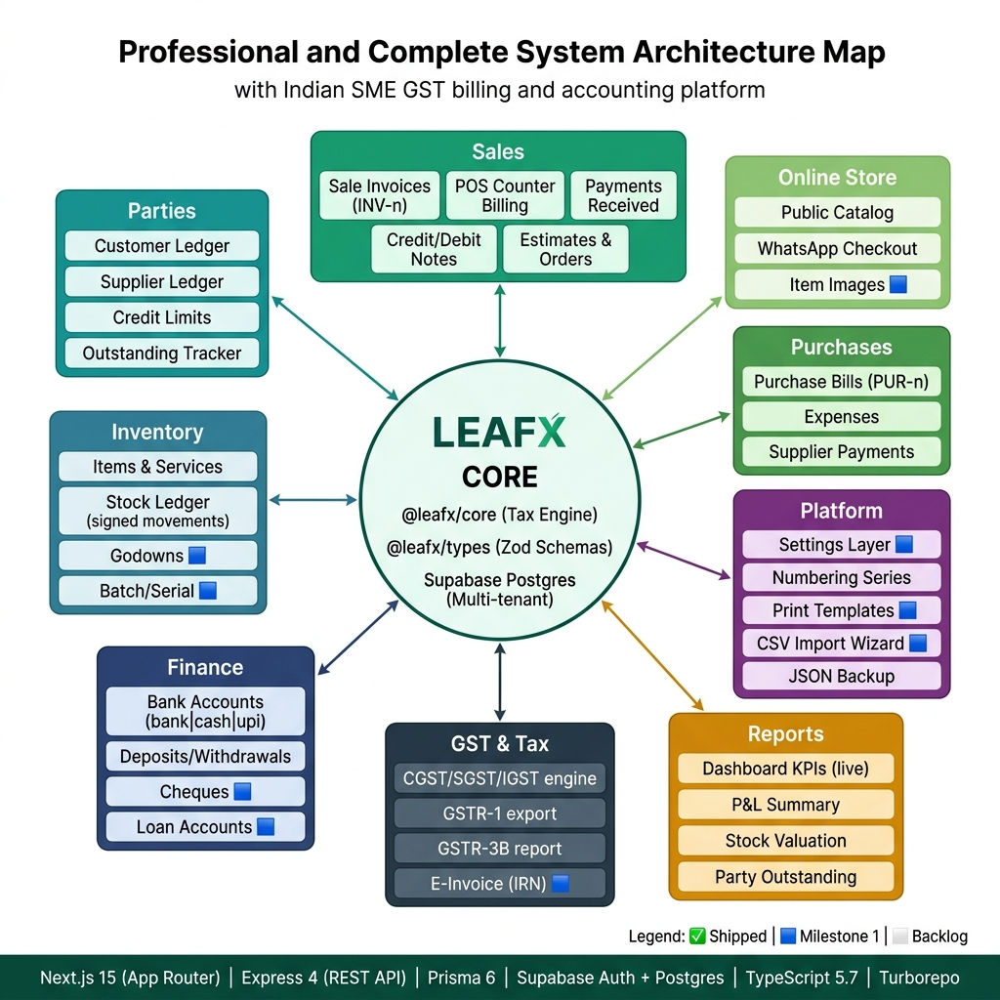

# Leafx — Architecture Knowledge Base

Living architecture docs for **Leafx**, a GST billing & accounting platform for Indian SMEs (a functionally-equivalent Vyapar clone). **One feature per markdown file**, grouped by domain. Every doc embeds **Mermaid diagrams** (ecosystem `flowchart`, `graph` architecture, `erDiagram` data model, `sequenceDiagram` flows) that render on GitHub and in VS Code (with the Markdown Preview Mermaid extension).

## System map
Hub-and-spoke: **Leafx Core** (`@leafx/core` tax engine + `@leafx/types` Zod schemas + multi-tenant Supabase Postgres) at the center, feature domains around it. Legend: ✅ Shipped · 🟦 Milestone 1 · ⬜ Backlog.



## How to read a feature doc
Each file follows the same 8-part template:
1. **Purpose** — what it does in 2–3 lines
2. **Ecosystem** — how it connects to other modules / API / Supabase
3. **Architecture** — component/layer diagram
4. **Data model** — relevant Prisma models
5. **Key flows** — sequence diagrams for main operations
6. **API surface** — endpoints
7. **Key files** — repo paths
8. **Status vs Vyapar** — Have / Partial / Planned

Legend: ✅ Have · 🟡 Partial · 🟦 Planned (Milestone 1) · ⬜ Backlog (M2+)

> **Roadmap:** the foundation milestone (Phases 0–16) is shipped — see [`../PLAN.md`](../PLAN.md).
> Everything marked 🟦 across these docs belongs to **[MILESTONE-1.md](MILESTONE-1.md)** (the shadcn UI
> migration + feature-depth plan); its task numbers and settings **Appendix A** are what the
> per-feature "(Task N)" / "Appendix A" references point to.

## Index

| Domain | Docs |
|---|---|
| **★ Roadmap** | [MILESTONE-1.md](MILESTONE-1.md) — next-milestone task plan + settings Appendix A |
| **00 · Overview** | [system-overview](00-overview/system-overview.md) · [tech-stack](00-overview/tech-stack.md) · [data-model-erd](00-overview/data-model-erd.md) |
| **01 · Auth & Tenancy** | [authentication](01-auth-tenancy/authentication.md) · [multi-firm-tenancy](01-auth-tenancy/multi-firm-tenancy.md) |
| **02 · Parties** | [parties](02-parties/parties.md) |
| **03 · Items & Inventory** | [items](03-items-inventory/items.md) · [stock-and-godowns](03-items-inventory/stock-and-godowns.md) · [batch-serial-tracking](03-items-inventory/batch-serial-tracking.md) |
| **04 · Sales** | [sale-invoices](04-sales/sale-invoices.md) · [pos](04-sales/pos.md) · [payments-in](04-sales/payments-in.md) |
| **05 · Purchases & Expenses** | [purchases](05-purchases-expenses/purchases.md) · [expenses-payments-out](05-purchases-expenses/expenses-payments-out.md) |
| **06 · Documents** | [estimates-orders-challans](06-documents/estimates-orders-challans.md) · [credit-debit-notes](06-documents/credit-debit-notes.md) |
| **07 · Cash & Bank** | [bank-accounts](07-cash-bank/bank-accounts.md) · [cheques-and-loans](07-cash-bank/cheques-and-loans.md) |
| **08 · GST & Tax** | [gst-tax-engine](08-gst-tax/gst-tax-engine.md) · [gstr1-einvoice](08-gst-tax/gstr1-einvoice.md) |
| **09 · Reports** | [reports](09-reports/reports.md) |
| **10 · Manufacturing** | [bom-production](10-manufacturing/bom-production.md) |
| **11 · Settings** | [settings-layer](11-settings/settings-layer.md) · [print-templates](11-settings/print-templates.md) |
| **12 · Branding** | [business-profile-branding](12-branding/business-profile-branding.md) |
| **13 · Online Store** | [online-store](13-online-store/online-store.md) |
| **14 · UI / Frontend** | [ui-architecture-shadcn](14-ui-frontend/ui-architecture-shadcn.md) · [app-shell-navigation](14-ui-frontend/app-shell-navigation.md) |
| **15 · Platform** | [numbering-series](15-platform/numbering-series.md) · [backup-import](15-platform/backup-import.md) |

## Monorepo map
```
Vyapar/
├── client/web        @leafx/web   — Next.js 15 App Router frontend
├── client/ui         @leafx/ui    — design tokens (TS + CSS vars)
├── server/api        @leafx/api   — Express REST API
├── server/prisma                  — Prisma schema + client (@leafx/db)
├── shared/core       @leafx/core  — money + GST tax engine (pure, tested)
├── shared/types      @leafx/types — Zod schemas / shared types
├── shared/config     @leafx/config— tsconfig base + Tailwind preset
└── architecture/                  — (this) living architecture docs
```
